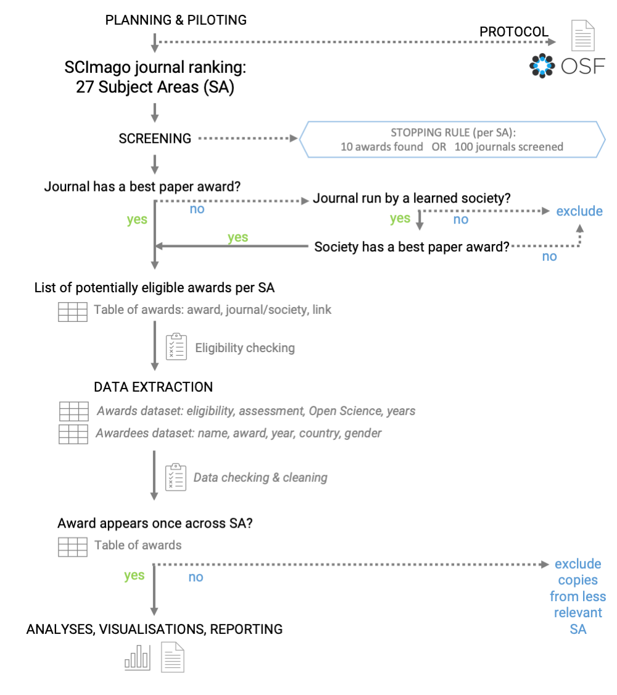

# Supplementary Methods  


  

#### Figure S1.   
*Project workflow. When an award was linked to a journal which had more than one SCImago Subject Area (SA) assigned, we used award description to choose the most fitting SA for the award (i.e. we excluded copies of the award record from the less relevant SA – see the bottom right corner of the workflow)*.   

## Project aim and general approach.   
“Best paper” (or equivalent) awards are usually associated with specific journals / societies / publishers. We aimed to conduct a systematic-like search to collect a sample of highly regarded awards (from top-ranking journals and societies) across a broad range of disciplines. We conducted the process collaboratively and transparently using shared Google Sheets documents (file copies were provided and re-integrated for participants who were not able to access online Google Docs).  

The initial project description and contribution guidelines were publicly available as GitHub pages: https://mlagisz.github.io/survey_best_paper_awards/. Project contributors were recruited via Open Science communities and conferences. They helped to pilot the project procedures and provided feedback on the project protocol, which was then updated to it second version. roject contributors self-assigned to the individual project tasks. Their actual contributions (completed tasks) were recorded on Google Sheets. Detailed project procedures were shared as a dedicated Project Manual on Google Docs. This document, with incorporated users’ feedback, is available at https://docs.google.com/document/d/1aw_HhKawpi264njGi--Ms-x-bOs_uQJBiOepQKE89pQ/edit?usp=sharing.  

## Award inclusion criteria.   
We followed pre-specified criteria outlined in the registered protocol (https://osf.io/93256) to increase data consistency and enable comparisons across disciplines:  
1. We only included awards for a single published research contribution in a format of a research article (theses / dissertations are allowed if published as a journal article).  
2. W only included awards managed by a journal, publisher, or a learned society.  
3. We excluded awards that are discontinued, and awards that are restricted to applicants from underrepresented groups, e.g., women-only / minorities-only awards.  

## Search and screening.  
Our starting point was from searching academic journals and societies/associations to identify those that award “Best Paper” prizes. To do so, we first used journal lists from 27 SCImago Subject Areas rankings (SCImago Journal & Country Rank (SJR) website at https://www.scimagojr.com/journalrank.php). To represent SAs evenly, we considered the top 100 journals from each SA list, or we will stop if we find 10 relevant awards before reaching this threshold.   

During the intial screening, for each journal list representing a SSCImago Subject Area, we checked if journal websites or announcements include “best paper” awards , and if not, we checked if journals are run by learned societies (i.e. are offciel journals of a given learned society/ies). If so, we also checked if a relevant learned society awards a “best paper” prize that fits in a given subject area being assessed. If a society awards multiple relevant awards in journals in the same subject area, we choose the one from our top 100 SA list or an award that appears to be most prestigious (e.g., with highest monetary value, oldest).  

For each subject area, we collated a preliminary list of 10-15 awards that meet our selection criteria for data extraction. If some of these awards got excluded during data extraction, we went back to the screening stage for that subject area to find replacement awards until we had 10 awards that are eligible for inclusion, or we ran out of journals to screen within the top 100 Subject Area list positions.  

## Screening cross-checking.  
All screened journal lists from 27 SCImago Subject Areas rankings (https://www.scimagojr.com) were independently cross-checked to detect potential mistakes (it is easy to miss a note about awards on journals or organizational webpages, misinterpret eligibility of the award, etc.).   

Project contributors self-assigned to one (or more) SCImago Subject Area - always different from the one they did initial Subject Areas screening.   

The checking person confirmed if screening information and decision recorded by the initial screener is correct and accurate.   

The checking person recorded in a new column (Award_name_extract) the name of the eligible award to be extracted and recorded any screening comments in additional columns.   

Obvious mistakes were fixed and any unclear or disputable cases have been commented on and discussed before being resolved.   

## Data extraction.   
For each 27 SCImago Subject Areas journal ranking (https://www.scimagojr.com), we extracted data on max. 10 awards that meet our selection criteria.   

For each award, its eligibility (as outlined in “Selection criteria”) for inclusion was confirmed during data extraction, and if deemed not eligible, no further data was be extracted.   

Using a pre-piloted Google Form, we extracted relevant data on each award from the websites (e.g., journals, societies, publishers) or other publicly available documents (e.g., instructions for applicants).   

The extracted pre-specified data included information on the granting journal / publisher / society, award eligibility criteria, award assessment criteria, and source of information on the past awardees (full metadata is provided alongside the data files).   

We archived web pages with award descriptions by saving them to .pdf files named after award names (as used in data extraction documents).   

The second stap of data extraction focused on the identities and characteristics of the past participants. For collecting data on individual winners, we had a data collection directly on a Google Sheet. We only collect data on winners from years 2001-2022. This data was used to infer patterns related to individual winners’ gender and country of affiliation. Specifically: Gender (binary: F = female, M = male, ? - unassigned) was be assigned to the past awardee names using information (pronouns, images, names) available on award websites, personal or institutional websites, or using https://gender-api.com/, with an accuracy threshold of >95 for assigning gender from first names. We noted instances of non-binary gender (not applicable) and also when we are unable to assign binary gender. Affiliation information (institution, country) was be assigned to past winners’ names for the year when the award was received using information available on award websites, personal or institutional websites, or information in the awarded paper. Additional information was also recorded: links to the websites with relevant information, type of source of information (award page, award announcement, article, other), whether award is shared (more than one author from one winning paper), whether photo or bio are provided on award page or award announcement, reference information and DOI for winning article, any additional notes.    

## Data extraction cross-checking.  
Extracted main award characteristics data (awarding body, description, etc.) has been independently cross-checked by a second researcher (i.e. one that did not extract the data). Obvious mistakes were fixed and any unclear or disputable cases have been commented on and discussed before being resolved.   

Extracted additional data (gender, affiliation country, and additional details on the award and winners) has been independently cross-checked by a second researcher (i.e. one that did not extract the data). Obvious mistakes were fixed and any unclear or disputable cases have been commented on and discussed before being resolved.   

## Deviations from the protocol.  
The pre-registered protocol is available on OSF (https://osf.io/93256).  
We acknowledge the following deviations from the protocol:   

1. We coded whether the award goes to an individual author (explicitly named) or to an article (without mentioning individual author/s). Some awards only lists winning articles and other focus on specific authors who were the prizewinners (sometimes even not mentioning for which exact article they got an award).   

2. In the protocol, we planned only to extract awardee names, gender and affiliations for winners from 2001 onwards. However, such data is only meaningful when an award is given to a specific individual researcher - thus, we did not extract such information for awards that only list winning papers (i.e. were awarded to the whole authorship team, not a particular person within the team).   

3. We coded whether the individual winners got their photo and/or bio shared online by the journals/societies. Photographs and bios make assigning gender easier and provide some extra recognition and visibility for the winners.   

4. We recorded the information (reference and DOI) on the winning article identity, where provided or findable. However, we did not use this information in the analyses, as it was solely for documentation and cross-checking purposes, since we extracted information on winner’s affiliation from the winning article when affiliation it was not reported on the award webpage or announcement.   

5. We recorded whether award criteria mention article impact indices (e.g. number of downloads or citations) and whether impact indices were the only criteria. Although impact indices give an impression of objectivity they are known to be biased and not necessarily reflect the quality of the published research. As such, we decided to include this information in our assessment of the award characteristics.   

6. For the analyses, we did not remove Subject Areas that had data extracted from fewer than 5 awards, as initially planned. This is because our main results are presented as totals across all Subject Areas. Also, the two Subject Areas to be potentially excluded were Medicine and Immunology, and we felt that removing them would make our findings less complete.  

7. For text mining of award descriptions, we ad hoc grouped the most common terms (truncated to word stems) into terms representing generic excellence and terms explicitly related to transparency and robustness.   

8. We were not able to seek clarifications from the award committees or contact person, because most of the award descriptions lacked contact details (see our additional results on the availability of the contact details).   

9.  In our plots by decade, we also showed the incomplete decade 2021-2022 - in our protocol we stated that only decades 2001-2010 and 2011-2020 will be shown.  

10. We used the year of earliest listed awardee as a proxy of award age and performed exploratory analyses of its associations with award characteristics.   


## Data processing and analyses - an overview.   
The main steps were as follows:

1. Uploading cross-checked meta-data, screening data and extracted data into R.   
2. Creating meta-data tables (variable descriptions) for each data set.   
3. Data pre-processing (e.g. merging SA into a single data frame, removing excluded awards).   
4. Summarizing data sets via tabulation and filtering.   
5. Creating figures for the supplementary materials - shown as in-text figures.   
6. Creating figures for the main manuscript text - saved as stand-alone files.   

NOTE: Steps 3-6 were done for each data set in turn.   

All code and results are provided below. Code for figures used in the main text is shown, but not evaluated for this supplementary document, because these figures are presented in the main text.   


## Project set up.  
NOTE: project github page can be found at https://github.com/mlagisz/survey_best_paper_awards.

Loading packages and general settings.   
```{r, warning = FALSE, message = FALSE}
#set global code chunk parameters for knitting:  
knitr::opts_chunk$set(echo = TRUE, warning = FALSE, message = FALSE, results = "hide") 

#load libraries (install if absent):  
pacman::p_load(tidyverse, #various tools
               here, #easy file paths
                DT, #data tables
                knitr, #document knitting
                ggimage, #adding images
                ggcharts, #plots functionality
                scales, #plots extra
                readxl, #loading Excel
                forcats, #category wrangling
                ggupset, #upset plots
                patchwork, #plot assembly
                stringr, #text wrangling
                ggbeeswarm, #beeswarm plots
                tidytext, #text processing
                stopwords, #text processing
                tokenizers, #text processing
                maps, #geographical mapping
                ggthemes, # plotting themes
                ggpatterns, #patterning for plots
                wacolors, #color-blind friendly color palettes
                lme4, #linear models
                sjPlot) #for tab_model reporting

## may need:
# install.packages("remotes")
# remotes::install_github("coolbutuseless/ggpattern")
library(ggpattern)

## set a global plotting theme with background transparency:   
theme_set(theme_classic(base_size = 14) + 
            theme(panel.background = element_blank(), 
                  plot.background = element_blank(), 
                  legend.background = element_blank(), 
                  text = element_text(colour = "white")))
```

## Loading data.   

Load SCImago Subject Area -level data set and an associated meta-data table:   

```{r}
# accessing all the sheets 
sheet_names <- excel_sheets(here("data", "scimagojr 2021  Subject Areas_screening.xlsx"))
sheet_names <- sheet_names[-1] #remove first sheet with meta-data
SA_list_all <- lapply(sheet_names, function(x) 
  {as.data.frame(read_excel(here("data", "scimagojr 2021  Subject Areas_screening.xlsx"), sheet = x))}) #read all sheets
names(SA_list_all) <- sheet_names  #rename list elements 
#lapply(SA_list_all, names) #extract column names
#unique(do.call(rbind, lapply(SA_list_all, names))) #making sure all have same column names
SAdata <- do.call(rbind, SA_list_all)
names(SAdata) <- gsub(" ","_", names(SAdata)) #change spaces to _ in the column names
names(SAdata) <- gsub("\\.","", names(SAdata)) #remove . the column names
SAdata <- SAdata %>% drop_na(Subject_area)
#table(is.na(SAdata$Title)) #note no empty journal names

SAmeta <- read_excel(here("data", "scimagojr 2021  Subject Areas_screening.xlsx"),
                     sheet = 1, skip = 1) #load SCImago SA meta-data
```

Load award-level data set and an associated meta-data table:   

```{r}
#BP load and prepare award-level meta-data
BPmeta <- read_excel(here("data", "Survey-Best_paper_awards (Responses)_SHAREDCOPY_checked.xlsx"),
                     sheet = 2, skip = 1) #load and skip first line

## load and prepare main extracted award-level data
BPdata <- read_excel(here("data","Survey-Best_paper_awards (Responses)_SHAREDCOPY_checked.xlsx"),
                     sheet = 1) #load main award data

names(BPdata) <- gsub(" ","_", names(BPdata)) #change spaces to _ in the column names

#rename selected data columns
BPdata <- BPdata %>% 
rename(Extractor_name = "Name_of_the_extracting_person",
       Award_name = "Full_name_of_the_award", 
       Journal_name = "Full_name_of_the_awarding_journal", 
       Award_description = "Paste_the_information_text_describing_the_award", 
       Eligible = "Confirm_eligibility_of_the_award",
       Awarding_journal = "Full_name_of_the_awarding_journal",
       Awarding_society = "Full_name_of_the_awarding_society",
       Awarding_other = "Full_name_of_the_awarding_publisher/other_body",  
       Career_stage = "Target_career_stage_of_eligible_applicants",
       Flexible_eligibility = "Flexibility_of_the_eligibility_criteria", 
       Assessors_transparency = "Assessor_transparency", 
       Open_science = "Valuing_Open_Science",  
       Self_nomination = "Self-nomination_allowed"
       )

##check for rows with empty "Scimago Subject Area" values
table(is.na(BPdata$Scimago_Subject_Area)) #4 rows from pilot screening
##remove rows with pilot extractions and empty "Scimago Subject Area" values
BPdata <- BPdata[!is.na(BPdata$Scimago_Subject_Area), ]

#remove awards that were duplicate-extracted and excluded at extraction stages
BPdata <- BPdata[BPdata$Row_excluded == 0, ]
dim(BPdata) #222 rows left
## [1] 222  54
##NOTE: total of 41 rows  removed as duplicates 
##(19 awards were doubly- or triply-extracted)

#create new variable for awards with description or without
BPdata$Descr_available <- fct_collapse(BPdata$Open_science,
  available = c("no", "yes"),
  "not available" = "not available"
)
```

Load winners-level data set and an associated meta-data table:   

```{r}
#load individual winners data
BPindiv <- read_csv(here("data", "BP_awards_lists_SHAREDCOPY - indiv_winners_20230915.csv"),
                    skip = 1) #load individual winners data

#load individual winners meta-data
BPindiv_meta <- read_csv(here("data", "BP_awards_lists_SHAREDCOPY - indiv_winners_meta-data.csv"),
                         skip = 1) #load individual winners data
```

Load country-level productivity SCImago data set:    

```{r}
#load SCImago 2021 country productivity (documents) data downloaded from https://www.scimagojr.com/countryrank.php?year=2021&min=0&min_type=it
COprod <- read_csv(here("data", "scimagojr country rank 2021.csv"), skip = 0) #load data

#create meta-data with columns:       
COprod_meta <- tibble("column name" = names(COprod), 
                      "description" = c("Rank of a given country across all Scimago Subject Areas.",
                                        "Country name.",
                                        "Country location classification into one of the eight SCImago Major World Regions.",
                                        "Number of documents associated with a goven country published in 2021.",
                                        "Number of citable documents associated with a goven country published in 2021.",
                                        "Number of citations to documents associated with a goven country published in 2021.",
                                        "Number of self-citations to documents associated with a goven country published in 2021.",
                                        "Number of citations per document associated with a goven country published in 2021.",
                                        "H index of a country in 2021." ),
                      "data type [options]" = c("integer",
                                                "free text",
                                                "free text",
                                                "integer",
                                                "integer",
                                                "integer",
                                                "integer",
                                                "numeric",
                                                "integer"
                                                ))
```

Load aythor contributorship data set:    

```{r}
#load people and tasks log table country productivity 
AUcontr <- read_csv(here("data", "BP_awards_lists_SHAREDCOPY - people_tasks log.csv"), skip = 0, n_max = 19) #load data

#simplify column names
names(AUcontr) <- c("name", 
                    "piloting_documentation",
                    "register_plan",
                    "plan_checks_feedback",
                    "journal_screening_(SA)",
                    "journal_screening_checks_(SA)",
                    "awards_data_extraction_(SA)",
                    "awards_data_extraction_checks_(SA)",
                    "awardees_data_extraction_(SA)",
                    "awardees_data_extraction_checks (SA)",
                    "data_wrangling",
                    "data_wrangling_checks",
                    "draft_writing",
                    "draft_checks_feedback",
                    "finalising_manuscript",
                    "finalising_manuscript_checks_feedback",
                    "author_order",
                    "author_position")

#create meta-data for all columns:         
AUcontr_meta <- tibble("column name" = names(AUcontr), 
                      "description" = c("Name of the author",
                                        "Contribution to project piloting and documentation (1 = yes, 0 = no)",
                                        "Contribution to registering the project plan (1 = yes, 0 = no)",
                                        "Contribution to checks and feedback on the project plan (1 = yes, 0 = no)",
                                        "Contribution to journal screening and awards shortlisting (number of Subject Areas)",
                                        "Contribution to cross-checking of journal screening and awards shortlisting (number of Subject Areas)",
                                        "Contribution to awards data extractions (number of Subject Areas)",
                                        "Contribution to cross-checking of awards data extractiosn (number of Subject Areas)",
                                        "Contribution to gender and affiliation data extraction (number of Subject Areas)",
                                        "Contribution to cross-checking of gender and affiliation data extraction (number of Subject Areas)",
                                        "Contribution to data cleaning and pilot analyses (1 = yes, 0 = no)",
                                        "Contribution to cross-checking ofdata cleaning and pilot analyses (1 = yes, 0 = no)",
                                        "Contribution to draft writing (1 = yes, 0 = no)",
                                        "Contribution to draft - checks and feedback (1 = yes, 0 = no)",
                                        "Contribution to finalising draft (1 = yes, 0 = no)",
                                        "Contribution to finalising draft - checks and feedback (1 = yes, 0 = no)",
                                        "Numeric position on the authorship list",
                                        "Position on the authorship list (first, middle, last)"),
                      "data type [options]" = c("text",
                                                "integer",
                                                "integer",
                                                "integer",
                                                "integer",
                                                "integer",
                                                "integer",
                                                "integer",
                                                "integer",
                                                "integer",
                                                "integer",
                                                "integer",
                                                "integer",
                                                "integer",
                                                "integer",
                                                "integer",
                                                "integer",
                                                "text"
                                                ))
```


## Meta-data tables.   

#### Table S1.    
*Meta-data for the SCImago journal rankings by Subject Areas dataset*.   

```{r}
## making a html table:
kable(SAmeta, "html") #%>%
  #kable_styling("striped", position = "left") #%>%
  #scroll_box(width = "100%", height = "1500px")
```

#### Table S2.   
*Meta-data for the Best Paper awards dataset*.   

```{r}
## making a html table:
kable(BPmeta, "html") #%>%
  #kable_styling("striped", position = "left") #%>%
  #scroll_box(width = "100%", height = "2500px")
```


#### Table S3.    
*Meta-data for the individual winners dataset*.    

```{r}
## making a html table:
kable(BPindiv_meta, "html") #%>%
  #kable_styling("striped", position = "left") #%>%
  #scroll_box(width = "100%", height = "1500px")
```

#### Table S4.    
*Meta-data for the author contributions dataset*.    

```{r}
## making a html table:
kable(AUcontr_meta, "html") #%>%
  #kable_styling("striped", position = "left") #%>%
  #scroll_box(width = "100%", height = "1500px")
```

# Supplementary Results

## Characteristics of SCImago Subject Area (SA) journal lists and screening data.   

Plot Number of journals per SCImago Subject Area:    

```{r}
##count journals per SA
# count_j_perSA <- SAdata %>%
#     count(Subject_area) %>%
#     arrange(desc(n)) 

#table(SAdata$Subject_area)
#min(table(SAdata$Subject_area))
#max(table(SAdata$Subject_area))

#all SA as a simple barplot
SAdata %>% 
  #filter(!is.na(Subject_area)) %>% 
  count(Subject_area) %>%
  arrange(Subject_area) %>%
  ggplot(aes(x = reorder(Subject_area, desc(Subject_area)), y = n)) +
  geom_bar(stat = "identity", position = position_dodge(0.9)) +
  coord_flip()
```

#### Figure S2.    
*Counts of journal Titles per SCImago ranking lists by Subject Area*.     

NOTE: The numbers of journals per Subject Area vary widely reflecting the differences in sizes of different research disciplines. Thus, random sampling of journals across Subject Areas could result in uneven representation of disciplines, potrentially biasing the findings towards the largest disciplines. By sampling similar number of journals with similar levels of “ranking” in each Subject Area, we were able to get a rough estimate of the frequency of the awards across disciplines.

## Overlap of journals across SCImago Subject Areas.  

```{r}
# length(unique(SAdata$Title)) #number of unique journals
# length(unique(SAdata$Title))/length(SAdata$Title) #60% unique

#reduce to top 100 from each SA
SAdata %>% 
  #filter(!is.na(Subject_area)) %>% 
  group_by(Subject_area) %>%
  top_n(100, Title) -> SAdata100

#count number of duplicated journal titles across all SA top 100 journal titles:
#sum(duplicated(SAdata100$Title)) #644 duplicated journal Titles (out of 2700)
#sum(duplicated(SAdata100$Title))/length(SAdata100$Title) #24% duplicated journal Titles (out of 2700)
```

Across the top 100 journals in each Subject Area ranking list there are `r sum(duplicated(SAdata100$Title))` duplicated journal titles (`r round(sum(duplicated(SAdata100$Title)) / length(SAdata100$Title) * 100, 0)`%). This indicates that one journal can often be classified into one or more related Subject Areas (e.g. “Trends in Cognitive Sciences” is included both in Neuroscience and Psychology Subject Areas). This overlap implies that the related awards will also often be relevant to more than one Subject Area. Thus, after the screening step, we checked for duplicate inclusions and data extractions and assigner each award to only one Subject Area for the analyses to avoid double-counting.    

## Award-level dataset characteristics.     

Overall summary:   

Total number of unique names of awards: `r length(unique(BPdata$Award_name))`.     
Total number of unique names of awards: `r length(unique(BPdata$Scimago_Subject_Area))`.  

Total number of awards without award description: `r table(BPdata$Descr_available, useNA = "always")[2]` (`r round(table(BPdata$Descr_available, useNA = "always")[2] / length(BPdata$Descr_available) * 100, 0)`%).    

Total number of individual winners records extracted: `r length(BPindiv$awardee_name)`.   
Total number of unique names of individual winners records extracted: `r length(unique(BPindiv$awardee_name))` (`r round(length(unique(BPindiv$awardee_name)) / length(BPindiv$awardee_name) * 100,0)`%).       


Awarding bodies:    

Total number of awards associated with a journal: `r sum(BPdata$Awarding_journal != "NA")` (`r round(sum(BPdata$Awarding_journal != "NA") / sum(BPdata$Descr_available == "available") * 100, 0)`%).     
Total number of awards associated with a society: `r sum(BPdata$Awarding_society != "NA")` (`r round(sum(BPdata$Awarding_society != "NA") / sum(BPdata$Descr_available == "available") * 100, 0)`%).     
Total number of awards associated with other awarding body: `r sum(BPdata$Awarding_other != "NA")` (`r round(sum(BPdata$Awarding_other != "NA") / sum(BPdata$Descr_available == "available") * 100, 0)`%).   
Note: one oward could be associated with more than one category from above.   


Overlap of awarding journals across SA: `r sum(duplicated(BPdata$Awarding_journal[BPdata$Awarding_journal != "NA"]))` (`r round(sum(duplicated(BPdata$Awarding_journal[BPdata$Awarding_journal != "NA"])) / sum(BPdata$Descr_available == "available") * 100, 0)`%).   
Overlap of of awarding societies across SA: `r sum(duplicated(BPdata$Awarding_society[BPdata$Awarding_society != "NA"]))` (`r round(sum(duplicated(BPdata$Awarding_society[BPdata$Awarding_society != "NA"])) / sum(BPdata$Descr_available == "available") * 100, 0)`%).      
Overlap of awarding other bodies across SA: `r sum(duplicated(BPdata$Awarding_other[BPdata$Awarding_other != "NA"]))` (`r round(sum(duplicated(BPdata$Awarding_other[BPdata$Awarding_other != "NA"])) / sum(BPdata$Descr_available == "available") * 100, 0)`%).      

```{r, eval = FALSE}
##### Initial data sanity checks (Note: code chunk not evaluated on knitting)
  
##Check award names - same award could have been extracted in different SA, or different awards have same names 
# table(duplicated(BPdata$Award_name)) #0 duplicated, 222 unique

## Simple counts

# #eligible awards per SA
# count_awards_perSA <- BPdata %>% 
#     count(Scimago_Subject_Area) #%>%
#     #arrange(desc(n)) 
 
# #count number of unique awards per year:
# BPindiv %>% 
#   #filter(!is.na(affiliation_country)) %>% 
#   group_by(award_year) %>% 
#   summarise(count = n_distinct(award_name))  

##How many awards per Scimago_Subject_Area
# table(BPdata$Scimago_Subject_Area) #note many SA with <10 extracted awards 
#- this is because of many journals being shared between SA

table(BPdata$Awarding_journal == "NA") #46 not associated with a journal
table(BPdata$Awarding_society == "NA") #78 not associated with a learned society
table(BPdata$Career_stage, useNA = "always")
table(BPdata$Award_individual, useNA = "always") #66 yes
table(BPdata$Flexible_eligibility, useNA = "always") #only 5 - "yes" 
#View(BPdata[BPdata$Flexible_eligibility == "yes", ]) #see rows with "yes"

#two-way table for the Career_stage and Flexible_eligibility
table(BPdata$Career_stage, BPdata$Flexible_eligibility, useNA = "always") #most "not applicable" is for "any career stage"

#two-way table for the Flexible_eligibility and Award_individual
table(BPdata$Flexible_eligibility, BPdata$Award_individual, useNA = "always") #flexible ones are for ECRs only

#two-way table for the Career_stage and Award_individual
table(BPdata$Career_stage, BPdata$Award_individual, useNA = "always") #individual are mostly for ECRs
#BPdata$Award_name[BPdata$Career_stage == "unclear"]
#BPdata$Award_name[BPdata$Career_stage == "early-career" & BPdata$Award_individual == "no"]
#BPdata$Award_name[BPdata$Career_stage == "early-career" & BPdata$Award_individual == "no"]
#length(BPdata$Award_name[BPdata$Career_stage == "any career stage" & BPdata$Award_individual == "no"]) #150

#three-way table
table(BPdata$Career_stage, BPdata$Flexible_eligibility, BPdata$Award_individual) #most "not applicable" is for "any career stage"

length(BPdata$Award_name[BPdata$Award_individual == "no" & 
                           BPdata$Career_stage == "any career stage" & 
                           BPdata$Flexible_eligibility == "not applicable"]) #147 not applicable flexibility

length(BPdata$Award_name[BPdata$Award_individual == "no" & 
                           BPdata$Career_stage == "any career stage" & 
                           BPdata$Flexible_eligibility == "not available"]) #3 with no description

length(BPdata$Award_name[BPdata$Award_individual == "no" & 
                           BPdata$Career_stage == "any career stage" & 
                           BPdata$Flexible_eligibility == "yes"]) #0 with flexibility

length(BPdata$Award_name[BPdata$Award_individual == "yes" & 
                           BPdata$Career_stage == "any career stage"]) #28 not limited to specific career stage

length(BPdata$Award_name[BPdata$Award_individual == "yes" & 
                           BPdata$Flexible_eligibility == "not applicable"]) #38 not applicable flexibility

length(BPdata$Award_name[BPdata$Award_individual == "yes" & 
                           BPdata$Flexible_eligibility == "not available"]) #2 with no description

length(BPdata$Award_name[BPdata$Award_individual == "yes" & 
                           BPdata$Flexible_eligibility == "yes"]) #5 with flexibility

table(BPdata$Inclusivity_statement, useNA = "always") #only 2 with "yes"

#BPdata$Award_name[BPdata$Inclusivity_statement == "yes"] #see rows with "yes"

table(BPdata$Assessors_transparency, useNA = "always") #114 "yes"
#View(BPdata[BPdata$Assessors_transparency == "yes", ]) #see rows with "yes"

# sum(str_count(tolower(BPdata$Assessor_phrasing), "editor"), na.rm = TRUE) #162 - counting all mentions
# sum(str_detect(BPdata$Assessor_phrasing, "editor"), na.rm = TRUE) #36 - counting once per award

table(BPdata$Process_transparency, useNA = "always") #only 2 "yes"
#BPdata$Award_name[BPdata$Process_transparency == "yes"] #see award name with "yes"
#View(BPdata[BPdata$Process_transparency == "yes",]) #see award name with "yes"

table(BPdata$Self_nomination, useNA = "always") #28 yes
#View(BPdata[BPdata$Self_nomination == "yes", ]) #see rows with "yes"

table(BPdata$Letter_required, useNA = "always") #38 yes
#View(BPdata[BPdata$Letter_required == "yes", ]) #see rows with "yes"

table(BPdata$Letter_required, BPdata$Self_nomination, useNA = "always") #two-way table
dim(BPdata[BPdata$Letter_required == "yes" & BPdata$Self_nomination == "yes", ])[1] #mentioning letter and self-nomination 
dim(BPdata[BPdata$Letter_required == "no" & BPdata$Self_nomination == "no", ])[1] #not mentioning letter and self-nomination 

table(BPdata$Feedback_availability, useNA = "always") #0 "yes"

table(BPdata$Award_contact_provided, useNA = "always") #38 "yes"

table(BPdata$Criteria_transparency, useNA = "always") #40 yes
#View(BPdata[BPdata$Criteria_transparency == "yes", ]) #see rows with "yes"

table(BPdata$Award_impact_metrics_mentioned, useNA = "always") #21 "yes"

table(BPdata$Award_impact_metrics_only, useNA = "always") #8 "yes"

table(BPdata$Open_science, useNA = "always") #1 "yes"
#View(BPdata[BPdata$Open_science == "yes", ]) #see rows with "yes": Social Sciences: Review Of Research Award  by American Educational Research Association. Two journals are considered: Review of Educational Research. Review of Research in Education

table(BPdata$Awardee_list_most_recent_year, useNA = "always") #a few <2020 and 19 NA
#View(BPdata[is.na(BPdata$Awardee_list_most_recent_year), ]) #see rows with NA

table(BPdata$Awardee_list_earliest_year, useNA = "always") #some old, 19 NA
#View(BPdata[is.na(BPdata$Awardee_list_earliest_year), ]) #see rows with NA
#hist(BPdata$Awardee_list_earliest_year)
length(BPdata$Awardee_list_earliest_year[BPdata$Awardee_list_earliest_year > 2010 & !is.na(BPdata$Awardee_list_earliest_year)] ) #107 from 2011-2023
```

#### Figure 1A.  
- Screening effort: count numbers of journals screened to get 10 shortlisted awards:

```{r}
#load journal screening summary dataset:
BPscreening <- read_csv(here("data","BP_awards_lists_SHAREDCOPY - scimagojr_2021_SA.csv")) #load award screening summary data
BPscreening <- BPscreening[!is.na(BPscreening$Subject_Area), ] #remove 2 extra rows without Subject_Area
count_awards_perSA <- BPdata %>% count(Scimago_Subject_Area) #count included awards per SA
BPscreening$N_included <- count_awards_perSA$n #add included award counts per SA
BPscreening$N_excluded <- BPscreening$N_records_screened - BPscreening$N_included 
BPscreening$Subject_Area <- as.factor(BPscreening$Subject_Area) #convert to factor

## reshape into long dataframe format:
BPscreening %>% select(Subject_Area, N_included, N_excluded) %>% gather(key = status, count, N_included:N_excluded) -> BPscreening_long

#reorder status levels and edit labels:
BPscreening_long <- BPscreening_long %>% 
  mutate(status = factor(status, levels = rev(c("N_excluded", "N_included"))))

BPscreening_long$status <- as.character(BPscreening_long$status)  #convert to character
#BPscreening_long$status[BPscreening_long$count <= 5] <- "N_included_low" #use to mark SA with 5 or less awards included    

#wacolors$san_juan #palette to be used
  
figure1A <- BPscreening_long %>%
    mutate(status = recode(status, 
                           'N_excluded' = 'not found', 
                           'N_included' = 'found and included')) %>%
    ggplot(aes(x = reorder(Subject_Area, desc(Subject_Area)), 
               y = count, fill = status)) + 
    geom_col(width = 0.8, 
             position = position_stack(reverse = TRUE)) +
    coord_flip() +
    scale_y_continuous(breaks = c(0,25,50,75,100)) +
    theme_bw() + 
    scale_fill_manual(values = c("#CA884C", "#BAAF9F")) +
    labs(x = "", 
         y = "Count of screened journals", 
         fill = "Award: ") + 
    theme(legend.position = "top", 
          legend.justification = c(0, 1), 
          legend.title = element_text(size = rel(0.7)), 
          legend.text = element_text(size = rel(0.7)), 
          axis.title.x = element_text(size = 10, hjust = 0.5),
          plot.margin = unit(c(0, 0, 0, 0), "pt")) +
    geom_hline(yintercept = 10, 
               linetype = "dotted", 
               color = "black", 
               linewidth = 0.7) +
    scale_x_discrete(position = "top")
```

#### Figure 1B.  
- Counts of incuded awards with and without award description:    

```{r}
figure1B <- BPdata %>%
    count(Scimago_Subject_Area, Descr_available) %>%
    arrange(desc(n)) %>%
    ggplot(aes(x = reorder(Scimago_Subject_Area, desc(Scimago_Subject_Area)), 
               y = n, 
               fill = Descr_available)) + 
    geom_col(width = 0.8, 
             position = position_stack(reverse = TRUE)) +
    coord_flip() +
    scale_y_continuous(breaks = c(0,5,10)) +
    theme_bw() + 
    scale_fill_manual(values = c("#3A5775", "#C9DCE2")) +
    labs(x = "", 
         y = "Count of included awards", 
         fill = "Award description:") + 
    scale_x_discrete(labels = NULL) + 
    labs(x = "")  + #used to remove vertical labels, also breaks = NULL
    theme(legend.position = "top", 
          legend.title = element_text(size = rel(0.7)), 
          legend.text = element_text(size = rel(0.7)), 
          axis.title.x = element_text(size = 10),
          plot.margin = unit(c(0, 0, 0, 0), "pt"))
```


## Award descriptions.   

Word counts per award description:   

```{r}
#add new variable with counts of words in the award description:
BPdata$Award_description_wordcount <- str_count(BPdata$Award_description, "\\w+")
#hist(str_count(BPdata$Award_description, "\\w+"), breaks = 20)

dim(BPdata[is.na(BPdata$Scimago_Subject_Area), ])[1] #no NA, but no description was coded as NA, so if 1 then change to 0 (no description)
BPdata$Award_description_wordcount[BPdata$Award_description_wordcount < 2] <- 0 #if 1 then change to 0 (no description)
length(BPdata$Award_description_wordcount[BPdata$Award_description_wordcount == 0]) #11 awards without description (0 words)
#dim(BPdata[BPdata$Award_description_wordcount < 100, ])[1] #descriptions have less than 100 words! (includes 11 with no description)
```

Number of awards with less than 100-word description: `r dim(BPdata[BPdata$Award_description_wordcount < 100, ])[1]` (`r round(dim(BPdata[BPdata$Award_description_wordcount < 100, ])[1] / dim(BPdata[BPdata$Award_description_wordcount != 0, ])[1] * 100, 1)`% of `r dim(BPdata[BPdata$Award_description_wordcount != 0, ])[1]` awards with descriptions).   

Median length of award description: `r median(BPdata$Award_description_wordcount[BPdata$Award_description_wordcount != 0])`.   

#### Figure 1C.  
- Plot of award description lengths - overall:      

```{r}
figure1C <- BPdata %>% 
  filter(!is.na(Award_description_wordcount)) %>%
  ggplot(aes(x = Award_description_wordcount)) + 
  geom_histogram(binwidth = 20, 
                 fill = "#21281D") +
  theme_bw() + 
  labs(x = "Number of words in award description", 
       y = "Award count") + 
  scale_x_continuous(breaks = c(seq(0, 1000, by = 100))) +
  theme(legend.position = "none", 
        axis.title.x = element_text(size = 10))
```

Plot description word count by Subject Area:    

```{r}
BPdata %>% 
  filter(!is.na(Award_description_wordcount)) %>%
  ggplot(aes(x = Award_description_wordcount)) + 
  geom_histogram(binwidth = 20, 
                 fill = "#21281D") +
  theme_bw() + 
  labs(x = "Number of words in award description", 
       y = "Award count") + 
  scale_x_continuous(breaks = c(seq(0, 1000, by = 100))) +
  theme(legend.position = "none", 
        axis.title.x = element_text(size = 10)) + 
  facet_wrap(~Scimago_Subject_Area, 
             ncol = 3)
```

#### Figure S3.   
Plot of award description lengths - by Subject Area.   

## Award ages   

NOTE: Using the year of oldest listed past winner as a proxy.   


#### Figure 1D.    
- award age overall distribution:    

```{r}
#table(!is.na(BPdata$Awardee_list_earliest_year)) # values available

#plot overall - beeswarm
figure1D <- BPdata %>% 
  filter(!is.na(Awardee_list_earliest_year)) %>%
  ggplot(aes(y = Awardee_list_earliest_year, 
             x = Row_excluded)) + 
  geom_beeswarm(color = "#21281D", 
                alpha = 0.2, 
                cex = 3.3) +
  coord_flip() +
  theme_bw() + 
  labs(y = "Year first winner listed", 
       x = "") + 
  scale_x_discrete(labels = NULL) + 
  labs(x = "")  + #used to remove vertical labels, also breaks = NULL
  scale_y_continuous(breaks = c(seq(1900, 2030, by = 10))) +
  theme(legend.position = "none", 
        axis.title.x = element_text(size = 10)) +
  annotate("rect", 
           ymin = 2001, 
           ymax = 2022, 
           xmin = -1.5, 
           xmax = 1.5, 
           alpha = .1,
           fill = "#008B00")
```

Plot award ages by Subject Area:

```{r}
#plot by SA - beeswarm
BPdata %>% 
  filter(!is.na(Awardee_list_earliest_year)) %>%
  ggplot(aes(x = reorder(Scimago_Subject_Area, desc(Scimago_Subject_Area)), y = Awardee_list_earliest_year)) + 
  geom_beeswarm(color = "#21281D", alpha = 0.2) +
  coord_flip() +
  theme_bw() + 
  labs(y = "Year first winner listed", 
       x = "Scimago Subject Area") + 
  scale_y_continuous(breaks = c(seq(1900, 2030, by = 10))) +
  theme(legend.position = "none", 
        axis.title.x = element_text(size = 10))
```

#### Figure S4.   
*Plot of award earliest extracted winner award year - by Subject Area*.     

#### Figure 1.  
- Combine 4 panels and save:    

```{r}
#assemble the panels using patchwork package
figure1 <- (figure1A + figure1B) / figure1C / figure1D + 
  plot_layout(widths = c(1, 1), 
              heights = c(3, 1, 1)) +
  plot_annotation(tag_levels = "A")

#ggsave(plot = figure1, here("plots", "Fig1ABCD_screening_descriptions_v1.png"), width = 18.6, height = 18, units = "cm", dpi = "retina", scale = 1.2)
#ggsave(plot = figure1, here("plots", "Fig1ABCD_screening_descriptions_v1.pdf"), width = 18.6, height = 18, units = "cm", scale = 1.2)
```

Summary by award age:    
- Award year of the earliest listed winner used as a proxy: `r min(BPdata$Awardee_list_earliest_year, na.rm = TRUE)`.    
- Number of awards with the earliest listed winner known: `r  dim(BPdata[!is.na(BPdata$Awardee_list_earliest_year), ])[1]`.       
- Number of awards with the earliest listed winner in or before 2000: `r dim(BPdata[!is.na(BPdata$Awardee_list_earliest_year) & BPdata$Awardee_list_earliest_year <= 2000, ])[1]`.  
- Number of awards with the earliest listed winner within 2001-2010: `r dim(BPdata[!is.na(BPdata$Awardee_list_earliest_year) & BPdata$Awardee_list_earliest_year >= 2001 & BPdata$Awardee_list_earliest_year <= 2010, ])[1]`.  
- Number of awards with the earliest listed winner within 2011-2023: `r dim(BPdata[!is.na(BPdata$Awardee_list_earliest_year) & BPdata$Awardee_list_earliest_year >= 2011 & BPdata$Awardee_list_earliest_year <= 2023, ])[1]`.  


#### Figure 2A.  
- Awarding bodies:     

```{r}
# table(BPdata$Awarding_journal == "NA")
# table(BPdata$Awarding_society == "NA")
# table(BPdata$Awarding_other == "NA")

#create new variable with simple categorisation of awarding body type mentioned:
BPdata2 <- BPdata %>%
   mutate(
     Awarded_by = case_when(Awarding_journal != "NA" & Awarding_society == "NA" & Awarding_other == "NA" ~ "journal", 
     Awarding_journal == "NA" & BPdata$Awarding_society != "NA" & BPdata$Awarding_other == "NA" ~ "society", 
     Awarding_journal == "NA" & BPdata$Awarding_society == "NA" & BPdata$Awarding_other != "NA" ~ "other", 
     Awarding_journal != "NA" & BPdata$Awarding_society != "NA" & BPdata$Awarding_other == "NA" ~ "journal&society",
     Awarding_journal != "NA" & BPdata$Awarding_society != "NA" & BPdata$Awarding_other != "NA" ~ "journal&society&other", 
     Awarding_journal != "NA" & BPdata$Awarding_society == "NA" & BPdata$Awarding_other != "NA" ~ "journal&other", 
     Awarding_journal == "NA" & BPdata$Awarding_society != "NA" & BPdata$Awarding_other != "NA" ~ "society&other", 
     TRUE ~ "none")
   )

#table(BPdata$Awarded_by)

#create new variable for awards with description or without
BPdata2 %>%  
  select(Award_name, Awarding_journal, Awarding_society, Awarding_other) %>% 
  mutate(
    across(c(Awarding_journal, Awarding_society, Awarding_other), ~ if_else(. == "NA", FALSE, TRUE))
  ) -> BPdata2

#make upset plot using library(ggupset)
figure2A <- BPdata2 %>% 
  column_to_rownames(var = "Award_name") %>% 
  as_tibble(rownames = "Award_name") %>%
  gather(Body, Award, -Award_name) %>% 
  filter(Award) %>%
  select(-Award) %>%
  mutate(Body = recode(Body, 
                       'Awarding_journal' = 'journal', 
                       'Awarding_society' = 'society', 
                       'Awarding_other' = 'other')) %>%
  group_by(Award_name) %>%
  summarize(Awarding_bodies = list(Body)) %>%
  ggplot(aes(x = Awarding_bodies)) +
    geom_bar(fill = "#21281D", width = 0.8) +
    scale_y_continuous(limits = c(0, 200)) +
    scale_x_upset(order_by = c("freq")) +
    theme_combmatrix(combmatrix.panel.striped_background = FALSE,
                    combmatrix.panel.point.color.fill = "#21281D",
                    combmatrix.panel.line.size = 0,
                    plot.title = element_text(family = "sans", size = 20, face = "plain", color = "black"),
                    axis.title.x = element_text(family="sans", size = 14, color = "black", face="plain"), 
                    axis.title.y = element_text(family="sans", size = 14, color = "black", face = "plain", vjust = -2),
                    ) +
    labs(title = "A", 
         x = "Awarding bodies combination", 
         y = "Award count")
```

#### Figure 2B.  
- target awardee career stages:    

```{r}
#table(BPdata$Career_stage) #mai options: student, early-career, mid-career, any career stage, unclear

#create new variable with separate career stage values as a list
BPdata2 %>%  
  mutate(
    Career_stage_list = str_split(BPdata$Career_stage, pattern = ", ")
  ) -> BPdata2

#BPdata$Career_stage_list <- str_split(BPdata$Career_stage, pattern = ", ") #sam as above but modifies original data frame

#make upset plot using library(ggupset)
figure2B <- BPdata2 %>% 
  ggplot(aes(x = Career_stage_list)) +
    geom_bar(fill = "#21281D",width = 0.8) +
    scale_y_continuous(limits = c(0, 200)) +
    scale_x_upset(order_by = c("freq")) +
    theme_combmatrix(combmatrix.panel.striped_background = FALSE,
                    combmatrix.panel.point.color.fill = "#21281D",
                    combmatrix.panel.line.size = 0,
                    plot.title = element_text(family = "sans", size = 20, face = "plain", color = "#21281D"),
                    axis.title.x = element_text(family="sans", size = 14, color = "#21281D", face="plain"), 
                    axis.title.y = element_text(family="sans", size = 14, color = "#21281D", face = "plain", vjust = -2),
                    ) + 
    labs(title = "B", 
         x = "Target career stages combination", 
         y = "")
```

#### Figure 2.    
- combine 2 panels and save:   

```{r}
#assemble the panels using patchwork package
figure2 <- figure2A / figure2B + 
  plot_layout(ncol = 2, nrow = 1, widths = c(1, 1)) #+  plot_annotation(tag_levels = "A") #does not work with this lot type

#ggsave(plot = figure2, here("plots", "Fig2AB_award_descriptions_v1.png"), width = 18, height = 8, units = "cm", bg = "white", dpi = "retina", scale = 1.6)
#ggsave(plot = figure2, here("plots", "Fig2AB_award_descriptions_v1.pdf"), width = 18, height = 8, units = "cm", scale = 1.6)
```


Summary of included awards by awarding or funding body type:  
#names(BPdata)
- Total number of awards associated with a journal or a few related journals: `r sum(BPdata2$Awarding_journal)` (`r round(sum(BPdata2$Awarding_journal) / length(BPdata2$Awarding_journal) * 100, 0)`%).    
- Total number of awards associated with a learned society: `r sum(BPdata2$Awarding_society)` (`r round(sum(BPdata2$Awarding_society) / length(BPdata2$Awarding_society) * 100, 0)`%).    
- Total number of awards associated with other organisation (e.g. a publisher, university, charity): `r sum(BPdata2$Awarding_other)` (`r round(sum(BPdata2$Awarding_other) / length(BPdata2$Awarding_other) * 100, 0)`%).   
- Most commonly mentioned other organisations:  `r length(grep("Elsevier", BPdata$Awarding_other))` mention “Elsevier”, `r length(grep("Wiley", BPdata$Awarding_other))` mention “Wiley”.   

Summary by target career stage:    

- Total number of awards for ‘any career stage’ authors: `r length(grep("any career stage", BPdata$Career_stage))` (`r round(length(grep("any career stage", BPdata$Career_stage)) / dim(BPdata)[1] * 100, 0)`).  
- Total number of awards for ‘early career’ authors: `r length(grep("early career", BPdata$Career_stage))` (`r round(length(grep("aearly career", BPdata$Career_stage)) / dim(BPdata)[1] * 100, 0)`).  
- Total number of awards for ‘student’ authors: `r length(grep("student", BPdata$Career_stage))` (`r round(length(grep("student", BPdata$Career_stage)) / dim(BPdata)[1] * 100, 0)`).  
- Total number of awards for ‘student’ and/or ‘early career’ authors: `r length(grep("student, early-career", BPdata$Career_stage))` (`r round(length(grep("student, early-career", BPdata$Career_stage)) / dim(BPdata)[1] * 100, 0)`).  
- Total number of awards for ’mid-career’authors: `r length(grep("mid-career", BPdata$Career_stage))` (`r round(length(grep("mid-career", BPdata$Career_stage)) / dim(BPdata)[1] * 100, 0)`).  


#### Figure 3.  
- summary of extracted award characteristics:       

```{r}
#example of an unstacked bar plot for a single award characteristic - valying Open Science practices:
#BPdata %>%
#    count(Open_science) %>%
#    ggplot(aes(x = Open_science, y = n, fill = Open_science)) + 
#    geom_col(width = 0.7) +
#    geom_text(position = position_stack(vjust = 0.5), aes(label = n)) + 
#    theme_classic() + 
#    coord_flip() +
#    labs(x = "Open Science valued", y = "Article count", fill = "Open_science") + 
#    theme(legend.position = "none", axis.title.x = element_text(size = 10))
```

#### Figure 3A.   
- Summary plots of key award characteristics:

```{r}
BPdata %>% 
  select(Award_individual, Flexible_eligibility, Inclusivity_statement, Assessors_transparency, Award_integrity_mentioned, Process_transparency, Self_nomination, Letter_required, Feedback_availability, Award_contact_provided) -> BPdata3A

## reshape into long dataframe format:
BPdata3A %>% gather(key = var_name, value = value, 1:ncol(BPdata3A)) -> BPdata3Along

#reorder var_name levels
# BPdata3Along <- BPdata3Along %>% mutate(var_name = factor(var_name, levels = rev(c("Award_individual",
#                                                                             "Flexible_eligibility", 
#                                                                             "Inclusivity_statement", 
#                                                                             "Assessors_transparency", 
#                                                                             "Award_integrity_mentioned", 
#                                                                             "Process_transparency",
#                                                                             "Self_nomination", 
#                                                                             "Letter_required", 
#                                                                             "Feedback_availability", 
#                                                                             "Award_contact_provided" 
#                                                                             ))))


#reorder value levels:
# BPdata3Along <- BPdata3Along %>% mutate(value = factor(value, levels = rev(c("no",
#                                                                             "yes", 
#                                                                             "not applicable", 
#                                                                             "not available"))))

# colSums(BPdata3A == "no") #check how many "no" values each column has

BPdata3Along <- BPdata3Along %>% mutate(var_name = factor(var_name, levels = rev(c("Flexible_eligibility", 
                                                                            "Assessors_transparency",
                                                                            "Award_individual",
                                                                            "Letter_required", 
                                                                            "Self_nomination", 
                                                                            "Award_contact_provided", 
                                                                            "Award_integrity_mentioned",  
                                                                            "Inclusivity_statement", 
                                                                            "Process_transparency",
                                                                            "Feedback_availability" 
                                                                            ))))

BPdata3Along <- BPdata3Along %>% mutate(value = factor(value, levels = rev(c("yes", 
                                                                            "not available",                                                                                                                       "not applicable", 
                                                                            "no"))))
#wacolors$palouse #palette to be used

figure3A <- BPdata3Along %>% 
  group_by(var_name) %>% 
  count(var_name, value) %>% 
  ggplot(aes(x = var_name, 
             y = n, 
             fill = value, 
             #pattern = value, 
             #pattern_angle = value
             )) +
  #  geom_bar_pattern(stat = "identity", 
    # pattern_density = 0.1,
    # pattern_spacing = 0.024,
    # pattern_key_scale_factor = 0.8,
    # pattern_alpha = 0.5,
    # pattern_fill    = 'white',
    # pattern_colour  = 'white') +
  geom_col(width = 0.9) +
  coord_flip() +
  scale_fill_manual(values = c("#8A6172", "#C0A43D",  "#CCBA98", "#748A52")) +
  scale_x_discrete(labels = rev(c("Eligibility career timeline is flexible", 
                                  "Assessors are revealed",   
                                  "Award is focused on individual authors",
                                  "Nomination letter is required",                            
                                  "Self-nomination is allowed",
                                  "Award contact point is provided",
                                  "Award integrity mentioned", 
                                  "Inclusivity statement or encouragement is provided",
                                  "Process is transparent",
                                  "Feedback is availabile" 
                                  ))) +
  labs(x = "Award characteristics", 
       y = "Award count") + 
  theme_classic()
```

#### Figure 3B.    
- Summary plots of key award characteristics:

```{r}
BPdata %>% select(Criteria_transparency, 
                  Award_impact_metrics_mentioned, 
                  Award_impact_metrics_only, 
                  Open_science) -> BPdata3B

## reshape into long dataframe format:
BPdata3B %>% 
  gather(key = var_name, value = value, 1:ncol(BPdata3B)) -> BPdata3Blong
#str(BPdata3long)

#reorder var_name levels
BPdata3Blong <- BPdata3Blong %>% 
  mutate(var_name = factor(var_name, levels = rev(c( "Criteria_transparency", 
                                                     "Award_impact_metrics_mentioned", 
                                                     "Award_impact_metrics_only", 
                                                     "Open_science"))))

#reorder value levels:
BPdata3Blong <- BPdata3Blong %>% 
  mutate(value = factor(value, levels = rev(c("yes",
                                              "not available",
                                              "no"))))
figure3B <- BPdata3Blong %>% 
  group_by(var_name) %>% 
  count(var_name, value) %>% 
  #ggplot(aes(x = var_name, y = n, fill = value)) +
  ggplot(aes(x = var_name, 
             y = n, 
             fill = value, 
             #pattern = value, 
             #pattern_angle = value
             )) +
  # geom_bar_pattern(stat = "identity", 
  #   pattern_density = 0.1, 
  #   pattern_key_scale_factor = 0.4,
  #   pattern_alpha = 0.5,
  #   pattern_fill    = 'white',
  #   pattern_colour  = 'white') +
  geom_col(width = 0.9) +
  coord_flip() +
  scale_fill_manual(values = c("#8A6172", "#CCBA98", "#748A52" )) +
  #geom_bar(aes(fill = value), stat = "identity") +
  #coord_flip() +
  labs(x = "Award criteria", 
       y = "Award count") + 
  scale_x_discrete(labels = rev(c("Assessment criteria are detailed out",
                            "Impact metrics are mentioned in criteria",
                            "Impact metrics are only criteria", 
                            "Open Science practices are valued"))) +
  theme_classic()
```

#### Figure 3.   
- combine 2 panels and save:      

```{r}
#assemble the panels using patchwork package
figure3 <- figure3A / figure3B + 
  plot_layout(ncol = 1, nrow = 2, heights = c(2, 0.9)) + 
  plot_annotation(tag_levels = "A") 

#ggsave(plot = figure3, here("plots", "Fig3AB_award_descriptions_v2.png"), width = 18, height = 10, units = "cm", bg = "white", dpi = "retina", scale = 1.2)
#ggsave(plot = figure3, here("plots", "Fig3AB_award_descriptions_v2.pdf"), width = 18, height = 10, units = "cm", scale = 1.2)
```


Summary by focus on individuals (“individual award”) or whole article (“team award”):   

- Total number of awards for individual authors: `r length(grep("yes", BPdata$Award_individual))` (`r round(length(grep("yes", BPdata$Award_individual)) / length(BPdata$Award_individual) * 100, 0)`%).    
- Total number of awards for individual authors with any career stage being eligible: `r length(BPdata$Award_name[BPdata$Award_individual == "yes" & BPdata$Career_stage == "any career stage"])` (`r round(length(BPdata$Award_name[BPdata$Award_individual == "yes" & BPdata$Career_stage == "any career stage"]) / sum(str_count(BPdata$Award_individual, "yes")) * 100, 0)`%).  
- Total number of awards for individual authors with inflexible time limits for eligibility: `r length(BPdata$Award_name[BPdata$Award_individual == "yes" & BPdata$Flexible_eligibility == "no"])` (`r round(length(BPdata$Award_name[BPdata$Award_individual == "yes" & BPdata$Flexible_eligibility == "no"]) / sum(str_count(BPdata$Award_individual, "yes")) * 100, 0)`% of all individual awards).   
- Total number of awards for individual authors with flexible time limits for eligibility:  `r length(BPdata$Award_name[BPdata$Award_individual == "yes" & BPdata$Flexible_eligibility == "yes"])` (`r round(length(BPdata$Award_name[BPdata$Award_individual == "yes" & BPdata$Flexible_eligibility == "yes"]) / sum(str_count(BPdata$Award_individual, "yes")) * 100, 0)`% of all individual awards). Note: remaining are "not applicable", usually because there were no time-related limits for eligibility, e.g. due to any career stage being eligible.           

Summary by basic award characteristics:   

- Total number of awards with an inclusivity statement: `r sum(str_count(BPdata$Inclusivity_statement, "yes"))` (`r round(sum(str_count(BPdata$Inclusivity_statement, "yes")) / table(BPdata$Descr_available)[1] * 100, 0)`%).   
- Total number of awards with assessor transparency: `r sum(str_count(BPdata$Assessors_transparency, "yes"))` (`r round(sum(str_count(BPdata$Assessors_transparency, "yes")) / table(BPdata$Descr_available)[1] * 100, 0)`%).   
- Total number of awards with assessment integrity mentioned: `r sum(str_count(BPdata$Award_integrity_mentioned, "yes"), na.rm = TRUE)` (`r round(sum(str_count(BPdata$Award_integrity_mentioned, "yes"), na.rm = TRUE) / table(BPdata$Descr_available)[1] * 100, 0)`%).  
- Total number of awards with process transparency: `r sum(str_count(BPdata$Process_transparency, "yes"))` (`r round(sum(str_count(BPdata$Process_transparency, "yes")) / table(BPdata$Descr_available)[1] * 100, 0)`%).  
- Total number of awards with self-nomination allowed: `r sum(str_count(BPdata$Self_nomination, "yes"))` (`r round(sum(str_count(BPdata$Self_nomination, "yes")) / table(BPdata$Descr_available)[1] * 100, 0)`%).    
- Total number of awards with required nomination letter:`r sum(str_count(BPdata$Letter_required, "yes"))` (`r round(sum(str_count(BPdata$Letter_required, "yes")) / table(BPdata$Descr_available)[1] * 100, 0)`%).     
- Total number of awards with feedback available: `r sum(str_count(BPdata$Feedback_availability, "yes"))` (`r round(sum(str_count(BPdata$Feedback_availability, "yes")) / table(BPdata$Descr_available)[1] * 100, 0)`%).   
- Total number of awards with contact details available: `r sum(str_count(BPdata$Award_contact_provided, "yes"))` (`r round(sum(str_count(BPdata$Award_contact_provided, "yes")) / table(BPdata$Descr_available)[1] * 100, 0)`%).   

Summary by award criteria characteristics:   

- Total number of awards with non-vague criteria: `r sum(str_count(BPdata$Criteria_transparency, "yes"))` (`r round(sum(str_count(BPdata$Criteria_transparency, "yes")) / table(BPdata$Descr_available)[1] * 100, 0)`%).   
- Total number of awards mentioning impact metrics: `r sum(str_count(BPdata$Award_impact_metrics_mentioned, "yes"))` (`r round(sum(str_count(BPdata$Award_impact_metrics_mentioned, "yes")) / table(BPdata$Descr_available)[1] * 100, 0)`%).   
- Total number of awards based only on impact metrics: `r sum(str_count(BPdata$Award_impact_metrics_only, "yes"))` (`r round(sum(str_count(BPdata$Award_impact_metrics_only, "yes")) / table(BPdata$Descr_available)[1] * 100, 0)`%).
- Total number of awards which value Open Science: `r sum(str_count(BPdata$Open_science, "yes"))` (`r round(sum(str_count(BPdata$Open_science, "yes")) / table(BPdata$Descr_available)[1] * 100, 0)`%).

- Total number of awards with cash award: `r sum(str_count(BPdata$Award_cash, "yes"))` (`r round(sum(str_count(BPdata$Award_cash, "yes")) / table(BPdata$Descr_available)[1] * 100, 0)`%).


## Award characteristics by Subject Area.   


Plot Award_individual by Subject Area:   

```{r}
#table(BPdata$Award_individual) #as a table
#table(BPdata$Scimago_Subject_Area, BPdata$Award_individual) #as a table - 9 disciplines have 0!

BPdata %>% 
    mutate(Award_individual = factor(Award_individual, 
                                     levels = c("yes", 
                                                "no"))) %>% #reorder value levels
    count(Scimago_Subject_Area, Award_individual) %>%
    ggplot(aes(x = reorder(Scimago_Subject_Area, desc(Scimago_Subject_Area)), 
               y = n, 
               fill = Award_individual)) + 
    geom_col(width = 0.8, position = position_stack(reverse = TRUE)) +
    coord_flip() +
    scale_y_continuous(breaks = c(0, 5, 10)) +
    theme_classic() + 
    scale_fill_manual(values = c("#748A52", "#8A6172")) +
    labs(x = "Scimago Subject Area", 
         y = "Award count", 
         fill = "Award is focused on individual authors:") + 
    theme(legend.position = "top", 
          axis.title.x = element_text(size = 10))
```

#### Figure S5.   
*Individual-focused awards - by Subject Area*.  


Plot Flexible_eligibility by SA:   

```{r}
#table(BPdata$Flexible_eligibility, useNA = "always") #as a table
#table(BPdata$Scimago_Subject_Area, BPdata$Flexible_eligibility, useNA = "always") #as a table

BPdata %>% 
    mutate(Flexible_eligibility = factor(Flexible_eligibility, 
                                         levels = c("yes", 
                                                    "not available", 
                                                    "not applicable", 
                                                    "no"))) %>%
    count(Scimago_Subject_Area, Flexible_eligibility) %>%
    ggplot(aes(x = reorder(Scimago_Subject_Area, desc(Scimago_Subject_Area)), 
               y = n, 
               fill = Flexible_eligibility)) + 
    geom_col(width = 0.8, position = position_stack(reverse = TRUE)) +
    coord_flip() +
    scale_y_continuous(breaks = c(0, 5, 10)) +
    theme_classic() + 
    scale_fill_manual(values = c("#748A52", "#CCBA98", "#C0A43D", "#8A6172")) +
    #scale_fill_manual(values = c("#FA8072", "#FA807210", "#F1FFC1", "#C1FFC1")) +
    labs(x = "Scimago Subject Area", 
         y = "Award count", 
         fill = "Eligibility career timeline is flexible:") + 
    theme(legend.position = "top", 
          axis.title.x = element_text(size = 10))
```

#### Figure S6.   
*Award eligibility timeline flexibility - by Subject Area*.    

Plot Inclusivity_statement by SA:     

```{r}
#table(BPdata$Scimago_Subject_Area, BPdata$Inclusivity_statement) #as a table

BPdata %>% 
    mutate(Inclusivity_statement = factor(Inclusivity_statement, 
                                          levels = (c("yes", 
                                                      "not available", 
                                                      "no")))) %>% #reorder value levels
    count(Scimago_Subject_Area, Inclusivity_statement) %>%
    ggplot(aes(x = reorder(Scimago_Subject_Area, desc(Scimago_Subject_Area)), 
               y = n, 
               fill = Inclusivity_statement)) + 
    geom_col(width = 0.8, position = position_stack(reverse = TRUE)) +
    coord_flip() +
    scale_y_continuous(breaks = c(0, 5, 10)) +
    theme_classic() + 
    scale_fill_manual(values = c("#748A52", "#CCBA98", "#8A6172")) +
    labs(x = "Scimago Subject Area", 
         y = "Award count", 
         fill = "Inclusivity statement or encouragement is provided:") + 
    theme(legend.position = "top", 
          axis.title.x = element_text(size = 10))
```

#### Figure S7.   
*Award inclusivity statement or encouragement - by Subject Area*.     

Plot Assessors_transparency by SA:    

```{r}
#table(BPdata$Scimago_Subject_Area, BPdata$Assessors_transparency) #as a table

BPdata %>% 
    mutate(Assessors_transparency = factor(Assessors_transparency, levels = (c("yes", 
                                                                               "not available", 
                                                                               "no")))) %>% #reorder value levels
    count(Scimago_Subject_Area, Assessors_transparency) %>%
    ggplot(aes(x = reorder(Scimago_Subject_Area, desc(Scimago_Subject_Area)), 
               y = n, 
               fill = Assessors_transparency)) + 
    geom_col(width = 0.8, position = position_stack(reverse = TRUE)) +
    coord_flip() +
    scale_y_continuous(breaks = c(0, 5, 10)) +
    theme_classic() + 
    scale_fill_manual(values = c("#748A52", "#CCBA98", "#8A6172")) +
    labs(x = "Scimago Subject Area", 
         y = "Award count", 
         fill = "Assessors are revealed (names or as journal editors):") + 
    theme(legend.position = "top", 
          axis.title.x = element_text(size = 10))
```

#### Figure S8.    
*Award assessors transparency - by Subject Area*.    

Plot Process_transparency by SA:    

```{r}
#table(BPdata$Scimago_Subject_Area, BPdata$Process_transparency) #as a table

BPdata %>% 
    mutate(Process_transparency = factor(Process_transparency, levels = (c("yes", 
                                                                           "not available", 
                                                                           "no")))) %>% #reorder value levels
    count(Scimago_Subject_Area, Process_transparency) %>%
    ggplot(aes(x = reorder(Scimago_Subject_Area, desc(Scimago_Subject_Area)), 
               y = n, 
               fill = Process_transparency)) + 
    geom_col(width = 0.8, position = position_stack(reverse = TRUE)) +
    coord_flip() +
    scale_y_continuous(breaks = c(0, 5, 10)) +
    theme_classic() + 
    scale_fill_manual(values = c("#748A52", "#CCBA98", "#8A6172")) +
    labs(x = "Scimago Subject Area", 
         y = "Award count", 
         fill = "Process is transparent:") + 
    theme(legend.position = "top", 
          axis.title.x = element_text(size = 10))
```

#### Figure S9.    
*Award process transparency - by Subject Area*.    

Plot Self_nomination by SA:

```{r}
#table(BPdata$Scimago_Subject_Area, BPdata$Self_nomination) #as a table

BPdata %>% 
    mutate(Self_nomination = factor(Self_nomination, levels = (c("yes", 
                                                                 "not available", 
                                                                 "no")))) %>% #reorder value levels
    count(Scimago_Subject_Area, Self_nomination) %>%
    ggplot(aes(x = reorder(Scimago_Subject_Area, desc(Scimago_Subject_Area)), 
               y = n, 
               fill = Self_nomination)) + 
    geom_col(width = 0.8, position = position_stack(reverse = TRUE)) +
    coord_flip() +
    scale_y_continuous(breaks = c(0, 5, 10)) +
    theme_classic() + 
    scale_fill_manual(values = c("#748A52", "#CCBA98", "#8A6172")) +
    labs(x = "Scimago Subject Area", 
         y = "Award count", 
         fill = "Self-nomination is allowed:") + 
    theme(legend.position = "top", 
          axis.title.x = element_text(size = 10))
```

#### Figure S10.   
*Award self-nomination explicitly allowed - by Subject Area*.    

Plot Letter_required by SA:   

```{r}
#table(BPdata$Scimago_Subject_Area, BPdata$Letter_required) #as a table

BPdata %>% 
    mutate(Letter_required = factor(Letter_required, levels = (c("yes", 
                                                                 "not available", 
                                                                 "no")))) %>% #reorder value levels
    count(Scimago_Subject_Area, Letter_required) %>%
    ggplot(aes(x = reorder(Scimago_Subject_Area, desc(Scimago_Subject_Area)), 
               y = n, 
               fill = Letter_required)) + 
    geom_col(width = 0.8, position = position_stack(reverse = TRUE)) +
    coord_flip() +
    scale_y_continuous(breaks = c(0, 5, 10)) +
    theme_classic() + 
    scale_fill_manual(values = c("#748A52", "#CCBA98", "#8A6172")) +
    labs(x = "Scimago Subject Area", 
         y = "Award count", 
         fill = "Nomination letter is required:") + 
    theme(legend.position = "top", 
          axis.title.x = element_text(size = 10))
```

#### Figure S11.   
*Award nomination letter required - by Subject Area*.    

Plot Feedback_availability by SA:    

```{r}
#table(BPdata$Scimago_Subject_Area, BPdata$Feedback_availability) #as a table

BPdata %>% 
    mutate(Feedback_availability = factor(Feedback_availability, levels = (c("yes", 
                                                                             "not available", 
                                                                             "no")))) %>% #reorder value levels
    count(Scimago_Subject_Area, Feedback_availability) %>%
    ggplot(aes(x = reorder(Scimago_Subject_Area, desc(Scimago_Subject_Area)),
               y = n, 
               fill = Feedback_availability)) + 
    geom_col(width = 0.8, position = position_stack(reverse = TRUE)) +
    coord_flip() +
    scale_y_continuous(breaks = c(0, 5, 10)) +
    theme_classic() + 
    scale_fill_manual(values = c("#CCBA98", "#8A6172")) +
    labs(x = "Scimago Subject Area", 
         y = "Award count", 
         fill = "Feedback is availabile:") + 
    theme(legend.position = "top", 
          axis.title.x = element_text(size = 10))
```

#### Figure S12.   
*Award feedback availability - by Subject Area*.    

Plot Award_contact_provided by SA:    

```{r}
#table(BPdata$Scimago_Subject_Area, BPdata$Award_contact_provided) #as a table

BPdata %>% 
    mutate(Award_contact_provided = factor(Award_contact_provided, levels = (c("yes", 
                                                                               "not available", 
                                                                               "no")))) %>% #reorder value levels
    count(Scimago_Subject_Area, Award_contact_provided) %>%
    ggplot(aes(x = reorder(Scimago_Subject_Area, desc(Scimago_Subject_Area)), 
               y = n, 
               fill = Award_contact_provided)) + 
    geom_col(width = 0.8, position = position_stack(reverse = TRUE)) +
    coord_flip() +
    scale_y_continuous(breaks = c(0, 5, 10)) +
    theme_classic() + 
    scale_fill_manual(values = c("#748A52", "#CCBA98", "#8A6172")) +
    labs(x = "Scimago Subject Area", 
         y = "Award count", 
         fill = "Award contact point is provided:") + 
    theme(legend.position = "top", 
          axis.title.x = element_text(size = 10))
```

#### Figure S13.   
*Award contact point provided - by Subject Area*.    

Plot Criteria_transparency by SA:    

```{r}
#table(BPdata$Scimago_Subject_Area, BPdata$Criteria_transparency) #as a table

BPdata %>% 
    mutate(Criteria_transparency = factor(Criteria_transparency, levels = (c("yes", 
                                                                             "not available", 
                                                                             "no")))) %>% #reorder value levels
    count(Scimago_Subject_Area, Criteria_transparency) %>%
    ggplot(aes(x = reorder(Scimago_Subject_Area, desc(Scimago_Subject_Area)), 
               y = n, 
               fill = Criteria_transparency)) + 
    geom_col(width = 0.8, position = position_stack(reverse = TRUE)) +
    coord_flip() +
    scale_y_continuous(breaks = c(0, 5, 10)) +
    theme_classic() + 
    scale_fill_manual(values = c("#748A52", "#CCBA98", "#8A6172")) +
    labs(x = "Scimago Subject Area", 
         y = "Award count", 
         fill = "Assessment criteria are detailed out:") + 
    theme(legend.position = "top", 
          axis.title.x = element_text(size = 10))
```

#### Figure S14.  
*Detailed award assessment criteria - by Subject Area*.   

Plot Award_impact_metrics_mentioned by SA:   

```{r}
#table(BPdata$Scimago_Subject_Area, BPdata$Award_impact_metrics_mentioned) #as a table

BPdata %>% 
    mutate(Award_impact_metrics_mentioned = factor(Award_impact_metrics_mentioned, levels = (c("yes", 
                                                                                               "not available", 
                                                                                               "no")))) %>% #reorder value levels
    count(Scimago_Subject_Area, Award_impact_metrics_mentioned) %>%
    ggplot(aes(x = reorder(Scimago_Subject_Area, desc(Scimago_Subject_Area)), 
               y = n, 
               fill = Award_impact_metrics_mentioned)) + 
    geom_col(width = 0.8, position = position_stack(reverse = TRUE)) +
    coord_flip() +
    scale_y_continuous(breaks = c(0, 5, 10)) +
    theme_classic() + 
    scale_fill_manual(values = c("#748A52", "#CCBA98", "#8A6172")) +
    labs(x = "Scimago Subject Area", 
         y = "Award count", 
         fill = "Impact metrics are mentioned in criteria:") + 
    theme(legend.position = "top", 
          axis.title.x = element_text(size = 10))
```

#### Figure S15.   
*Award assessment criteria with impact metrics - by Subject Area*.   

Plot Award_impact_metrics_only by SA:   

```{r}
#table(BPdata$Scimago_Subject_Area, BPdata$Award_impact_metrics_only) #as a table

BPdata %>% 
    mutate(Award_impact_metrics_only = factor(Award_impact_metrics_only, levels = (c("yes", 
                                                                                     "not available", 
                                                                                     "no")))) %>% #reorder value levels
    count(Scimago_Subject_Area, Award_impact_metrics_only) %>%
    ggplot(aes(x = reorder(Scimago_Subject_Area, desc(Scimago_Subject_Area)), 
               y = n, 
               fill = Award_impact_metrics_only)) + 
    geom_col(width = 0.8, position = position_stack(reverse = TRUE)) +
    coord_flip() +
    scale_y_continuous(breaks = c(0, 5, 10)) +
    theme_classic() + 
    scale_fill_manual(values = c("#748A52", "#CCBA98", "#8A6172")) +
    labs(x = "Scimago Subject Area", 
         y = "Award count", 
         fill = "Impact metrics are only criteria:") + 
    theme(legend.position = "top", 
          axis.title.x = element_text(size = 10))
```

#### Figure S16.   
*Impact metrics as only criteria - award scores by Subject Area*.    

Plot Open_science by SA:    

```{r}
#table(BPdata$Scimago_Subject_Area, BPdata$Open_science) #as a table

BPdata %>% 
    mutate(Open_science = factor(Open_science, levels = (c("yes", 
                                                           "not available", 
                                                           "no")))) %>% #reorder value levels
    count(Scimago_Subject_Area, Open_science) %>%
    ggplot(aes(x = reorder(Scimago_Subject_Area, desc(Scimago_Subject_Area)), 
               y = n, 
               fill = Open_science)) + 
    geom_col(width = 0.8, position = position_stack(reverse = TRUE)) +
    coord_flip() +
    scale_y_continuous(breaks = c(0, 5, 10)) +
    theme_classic() + 
    scale_fill_manual(values = c("#748A52", "#CCBA98", "#8A6172")) +
    labs(x = "Scimago Subject Area", 
         y = "Award count", 
         fill = "Open Science practices are valued:") + 
    theme(legend.position = "top", 
          axis.title.x = element_text(size = 10))
```

#### Figure S17.   
*Open Science practices - award scores by Subject Area*.    

## Text mining of award descriptions.   

Award descriptions - frequencies of words:   
```{r}
#Using packages tidytext and stopwords
Award_description_txt <- tibble(txt = tolower(BPdata$Award_description))
Award_description_txt <- Award_description_txt %>% unnest_tokens(output = word, input = txt, token = "words", to_lower = TRUE) #restructure all descriptions as one-token-per-row format
Award_description_txt <- Award_description_txt %>% anti_join(get_stopwords()) #remove stop words from library(stopwords) 
## Joining with `by = join_by(word)`
Award_description_txt <- Award_description_txt %>% anti_join(get_stopwords()) #remove stop words from library(stopwords) 
## Joining with `by = join_by(word)`
Award_description_txt$word <- tokenize_word_stems(Award_description_txt$word) #make all word stems lowercase
word.freq <- Award_description_txt %>% count(word, sort = TRUE) #count words
```

Award descriptions - count mentions of specific words (stemmed):   

```{r}
#create list of specific words (stemmed) to count within strings
specific.words <- c("best", "outstand", "impact", "original", "significant", "merit", "excell", "innovat", "novel", "creativ", "transparen", "reliab", "robust", "reproduc", "replica", "rigor", "rigour", "trust")

#prepare award descriptions as a single lowercase string
descriptions <- BPdata %>% 
  filter(!is.na(Award_description)) %>% 
  select(Award_description) %>% 
  tolower() #single lowercase string

#sum of all mentions for each word
specific.words.mentions <- specific.words %>%
  map_int(~ str_count(tolower(descriptions), .x))

#prepare award descriptions while keeping them separate for each award
descriptions2 <- tolower(BPdata$Award_description) #vector of lowercase strings

#sum of mentions per award for each word (counts only one mention per award)
specific.words.mentions2 <- specific.words %>%
  map_int(~ sum(str_detect(descriptions2, .x), na.rm = TRUE))

# ## doing the same as above, but manually:
# #count all mentions of words(parts) individually, e.g.:
# sum(str_count(tolower(BPdata$Award_description), "best"), na.rm = TRUE) #169
# #counting once per award, e.g. 
# sum(str_detect(BPdata$Award_description, "best"), na.rm = TRUE) #82
```

#### Figure 4A.   
- frequencies of specific words - all mentions in award descriptions.      

```{r}
# create a simple data frame with two types of word counts:
words.df <- tibble(Words = specific.words, 
                            Count_all = specific.words.mentions,
                            Count_once = specific.words.mentions2)

# merge "rigor" and "rigour" as they are the same word with different spelling:
words.df %>%
  filter(Words %in% c("rigor", "rigour")) %>%
  summarize(Words = "rigor/rigour", across(c(Count_all, Count_once), sum)) %>%
  bind_rows(words.df, .) %>%
  filter(! Words %in% c("rigor", "rigour")) -> words.df

#wacolors$palouse #palette to be used

figure4A <- words.df %>%
    ggplot(aes(x = reorder(Words, Count_all), 
               y = Count_all)) + 
    geom_col(width = 0.8, 
             fill = "#2D3F4A") +
    coord_flip() +
    scale_y_continuous(breaks = c(0, 50, 100, 150), 
                       limits = c(0, 200)) +
    theme_bw() + 
    labs(x = "Word stem", y = "Count of all mentions") + 
    annotate(geom = "rect",xmin = 8.5, xmax = Inf, ymin = -Inf, ymax = Inf, fill = "#8A6172", alpha = 0.2) +
    annotate(geom = "rect",xmin = -Inf, xmax = 8.5, ymin = -Inf, ymax = Inf, fill = "#748A52", alpha = 0.2) +
    theme(legend.position = "none", 
          axis.title.x = element_text(size = 10))
```

#### Figure 4B.  
- frequencies of specific words - first mentions in award descriptions.   

```{r}
figure4B <- words.df %>%
    ggplot(aes(x = reorder(Words, Count_all), 
               y = Count_once)) + 
    geom_col(width = 0.8, 
             fill = "#2D3F4A", 
             alpha = 0.7) +
    coord_flip() +
    scale_y_continuous(breaks = c(0, 50, 100, 150), 
                       limits = c(0, 200)) +
    theme_bw() + 
    labs(x = "Word stem", 
         y = "Count of first mention per award") + 
    scale_x_discrete(labels = NULL) + 
    labs(x = "")  + #used to remove vertical labels, also breaks = NULL
    annotate(geom = "rect",xmin = 8.5, xmax = Inf, ymin = -Inf, ymax = Inf, fill = "#8A6172", alpha = 0.2) +
    annotate(geom = "rect",xmin = -Inf, xmax = 8.5, ymin = -Inf, ymax = Inf, fill = "#748A52", alpha = 0.2) +
    theme(legend.position = "none", 
          axis.title.x = element_text(size = 10))
```

#### Figure 4.   
- combine 2 panels and save.   

```{r}
#assemble the panels using patchwork package
figure4 <- figure4A / figure4B + 
  plot_layout(ncol = 2, nrow = 1) +
  plot_annotation(tag_levels = "A")
#ggsave(plot = figure4, here("plots", "Fig4AB_words_counts_v2.png"), width = 18, height = 8, units = "cm", dpi = "retina", scale = 1.2)
#ggsave(plot = figure4, here("plots", "Fig4AB_words_counts_v2.pdf"), width = 18, height = 8, units = "cm", scale = 1.2)
```

## Characteristics of past winners.   

```{r}
#length(unique(BPdata$Award_name[BPdata$N_winners_extracted != 0])) #61 - number from the records in the award-level data set
#length(unique(BPindiv$award_name)) #61 - number from records in past winner's data (matching)
```

Total number of extracted awards: `r length(unique(BPindiv$award_name))`.      
Number of Subject Areas with 0 extracted award winners: `r 27 - length(unique(BPdata$Scimago_Subject_Area[BPdata$N_winners_extracted != 0]))`.   


Plot numbers of awards extracted per SA:   

```{r}
# #from BPindiv:
# BPindiv %>%  
#   group_by(award_SA) %>%
#   summarise(count = n_distinct(award_name))

# #from BPindiv:
# BPindiv %>%
#   group_by(award_SA) %>%
#   summarise(count = n_distinct(award_name)) %>% summarise(mean(count)) #3

#from BPdata - with winners data:
BPdata %>% 
  group_by(Scimago_Subject_Area) %>% 
  filter(N_winners_extracted != 0) %>% 
  count(Scimago_Subject_Area) -> awards_perSA

#No data for: 
setdiff(unique(BPdata$Scimago_Subject_Area), unique(BPdata$Scimago_Subject_Area[BPdata$N_winners_extracted != 0])) -> awards_perSA_none

#combine two tibbles
awards_perSA <- bind_rows(awards_perSA ,tibble(Scimago_Subject_Area = awards_perSA_none, n = rep(0, length(awards_perSA_none))))


# #plot counts where >0 awards per SA
# p_count.awards.SA <- BPindiv %>% 
#   group_by(award_SA) %>%
#   summarise(count = n_distinct(award_name)) %>% 
#   ggplot(aes(x = reorder(award_SA, desc(award_SA)), 
#              y = count)) +
#   geom_bar(stat = "identity", 
#            position = position_dodge(0.9)) +
#   coord_flip() +
#   theme_bw() +
#   labs(x = "Scimago Subject Area", 
#        y = "Award count")  

#plot counts per SA for all SA
p_count.awards.SA <- awards_perSA %>% 
  ggplot(aes(x = reorder(Scimago_Subject_Area, desc(Scimago_Subject_Area)), 
             y = n)) +
  geom_bar(stat = "identity", 
           position = position_dodge(0.9)) +
  coord_flip() +
  theme_bw() +
  labs(x = "Scimago Subject Area", 
       y = "Award count")  

p_count.awards.SA
```

#### Figure S18.   
*Number of awards with extracted individual winners data - counts by Subject Area*.    

Total number of extracted records (awardee names): `r nrow(BPindiv)`.   

```{r}
#sum(BPdata$N_winners_extracted, na.rm = TRUE) #number from the records in the award-level data set
#dim(BPindiv)[1] #number of records in past winner's data (matching)
```

Plot numbers of records (names) extracted per SA:  

```{r}
#from BPdata:
BPdata %>% 
  group_by(Scimago_Subject_Area) %>% 
  select(N_winners_extracted) %>% 
  filter(!is.na(N_winners_extracted)) %>% 
  summarise(sum_winners = sum(N_winners_extracted), .groups = 'drop') -> winners_perSA1 #use for plotting all SA

#dim(winners_perSA1[winners_perSA1$sum_winners != 0, ])[1] #number of SA with any extracted names
#winners_perSA1[winners_perSA1$sum_winners != 0, ] #table of SA with any extracted names

##Using BPindiv
##Adding missing grouping variables: Scimago_Subject_Area
#table(BPindiv$award_SA)
#dim(table(BPindiv$award_SA, useNA = "always")) #19 SA with any extracted names
# BPindiv %>%
#   group_by(award_SA) %>% count() 
#   -> winners_perSA1_extracted #does not show SA with 0 extracted
#median(winners_perSA1_extracted$n) #42

# #plot counts where >0 winners per SA
# p_count.awardees.SA <- 
#   BPindiv %>% 
#   group_by(award_SA) %>% 
#   count() %>%
#   ggplot(aes(x = reorder(award_SA, desc(award_SA)), 
#              y = n)) +
#   geom_bar(stat = "identity", 
#            position = position_dodge(0.9)) +
#   coord_flip() +
#   theme_bw() +
#   #scale_x_discrete(labels = NULL) + labs(x = "")  + #used to remove vertical labels, also breaks = NULL
#   labs(x = "Scimago Subject Area", 
#        y = "Awardee count")  

#plot counts per SA for all SA
p_count.awardees.SA <- winners_perSA1 %>% 
  ggplot(aes(x = reorder(Scimago_Subject_Area, desc(Scimago_Subject_Area)), 
             y = sum_winners)) +
  geom_bar(stat = "identity", 
           position = position_dodge(0.9)) +
  coord_flip() +
  theme_bw() +
  labs(x = "Scimago Subject Area", 
       y = "Awardee count")  

p_count.awardees.SA
```

#### Figure S19.   
*Numbers of extracted individual winners - counts by Subject Area*.   

Number of Subject Areas without any extracted individual winners: 8.   

Plot numbers of awards with individual winner data per year:   
```{r}
BPindiv %>% 
  group_by(award_year) %>% 
  summarise(n = n_distinct(award_name)) %>%
  ggplot(aes(x = award_year, 
             y = n)) +
  geom_bar(stat = "identity", 
           position = position_dodge(0.9)) +
  theme_bw() +
  labs(x = "Award year", y = "Award count")  
```

#### Figure S20.  
*Number of extracted awards with individual winners names per year across all Subject Areas*.   

Plot numbers of individual winner records per year:   

```{r}
#table(BPindiv$award_year, useNA = "always")

BPindiv %>% 
  group_by(award_year) %>% 
  count() %>%
  ggplot(aes(x = award_year, 
             y = n)) +
  geom_bar(stat = "identity", 
           position = position_dodge(0.9)) +
  theme_bw() +
  labs(x = "Award year", 
       y = "Awardee count")  
```

#### Figure S21.  
*Number of extracted individual winners per year across all Subject Areas*.    

Number of individual winner records per decade:   

```{r}
#create decade variable 2001-2010, 2011-2020, 2021-2022
BPindiv %>%  mutate(Decade = case_when(
    award_year >= 2001 & award_year <= 2010 ~ "2001-2010",
    award_year >= 2011 & award_year <= 2020 ~ "2011-2020",
    award_year >= 2021 & award_year <= 2022 ~ "2021-2022",
    award_year == "Veterinary" ~ "Biology",
    TRUE ~ NA)
    ) -> BPindiv

#table(BPindiv$Decade, useNA = "always")

## 2001-2010 2011-2020 2021-2022      <NA> 
##       165       720       194         0
```

## Counts of extracted past awardees by decade:     
- 2001-2010: `r table(BPindiv$Decade, useNA = "always")[1]`.   
- 2011-2020: `r table(BPindiv$Decade, useNA = "always")[2]`.   
- 2021-2022: `r table(BPindiv$Decade, useNA = "always")[3]`.   

```{r}
#table(BPindiv$shared, useNA = "always") #156 shared (14% of names), usually shared by 2 authors)
#table(BPindiv$Decade, BPindiv$shared) #more common recently
#table(BPindiv$award_SA, BPindiv$shared) # sharing most frequent in Computer Science
```

Number of individuals sharing awards: `r table(BPindiv$shared, useNA = "always")[2]` (`r round(table(BPindiv$shared, useNA = "always")[2] / length(BPindiv$shared) * 100, 0)`%).   

NOTE: during the first round of data extraction, we located around 3/4 of the winning articles - these were articles where title or DOI were available on the award page or announcement. Often article information was publicly listed only for recently awarded articles and absent for the older ones. Our additional Internet searches increased the number of identified articles.   

Number of awards with article information (only reference): `r table(is.na(BPindiv$awarded_paper_ref))[1]` (`r round(table(is.na(BPindiv$awarded_paper_ref))[1] / length(BPindiv$awarded_paper_ref) * 100, 0)`).    
Number of awards with article information (only DOI): `r table(is.na(BPindiv$awarded_paper_doi))[1]` (`r round(table(is.na(BPindiv$awarded_paper_doi))[1] / length(BPindiv$awarded_paper_doi) * 100, 0)`).     
Number of awards with article information (reference or DOI): `r table(!is.na(BPindiv$awarded_paper_ref) & !is.na(BPindiv$awarded_paper_doi))[2]` (`r round(table(!is.na(BPindiv$awarded_paper_ref) & !is.na(BPindiv$awarded_paper_doi))[2] / length(BPindiv$awarded_paper_ref) * 100, 0)`%).   


## Awardee gender.   

Source of information on gender:   
- Pronouns: `r table(BPindiv$gender_source == "pronouns")[2]` (`r round(table(BPindiv$gender_source == "pronouns")[2] / length(BPindiv$gender_source) * 100, 0)`%).   
- Photo: `r table(BPindiv$gender_source == "photo")[2]` (`r round(table(BPindiv$gender_source == "photo")[2] / length(BPindiv$gender_source) * 100, 0)`%).   
- Name only:`r table(BPindiv$gender_source == "name")[2]` (`r round(table(BPindiv$gender_source == "name")[2] / length(BPindiv$gender_source) * 100, 0)`%).   

Total number of past awardees without gender assigned: `r sum(is.na(BPindiv$awardee_gender))`.    
Total number of past awardees assigned as a woman: `r table(BPindiv$awardee_gender == "F")[2]` (`r round(table(BPindiv$awardee_gender == "F")[2] / length(BPindiv$awardee_gender) * 100, 0)`%).    
Total number of past awardees assigned as a man: `r table(BPindiv$awardee_gender == "M")[2]` (`r round(table(BPindiv$awardee_gender == "M")[2] / length(BPindiv$awardee_gender) * 100, 0)`%).    

Plot gender counts overall:  

```{r}
#wacolors$san_juan

## set the levels in order we want:
BPindiv$Gender <- factor(BPindiv$awardee_gender)
levels(BPindiv$Gender) <- c("female", "male")

## plot for a all SA and years - not stacked, with count values:
BPindiv %>%  
#  group_by(award_SA) %>%
  count(Gender) %>%
  ggplot(aes(x = Gender, 
             y = n)) +
  geom_bar(aes(fill = Gender), 
           stat = "identity", 
           position = position_dodge(0.9)) +
  scale_fill_manual(values = c("#CA884C", "#3A5775")) +
  theme_bw() +
  theme(legend.position = "none", 
        legend.box = "horizontal", 
        axis.text = element_text(size = 10)) +
  labs(fill = "Awardee gender:") +
  labs(x = "Awardees", 
       y = "Awardee count")  
```

#### Figure S22
*Counts of the past awardees (across all Subject Areas) assigned as female or male based on their pronouns, photos and names. F = female/women, M = male/men*.   

Plot gender counts by year:   

```{r}
#wacolors$san_juan

BPindiv %>% 
  group_by(award_year) %>%
  count(awardee_gender) %>%
  ggplot(aes(x = award_year, 
             y = n, 
             fill = awardee_gender)) +
  geom_bar(stat = "identity", position = position_dodge(0.9)) +
  theme_bw() + 
  scale_fill_manual(values = c("#CA884C", "#3A5775")) +
  theme(legend.position = "top", 
        legend.box = "horizontal", 
        axis.text = element_text(size = 10)) +
  labs(fill = "Awardee gender:") +
  labs(x = "Award year", 
       y = "Awardee count") 
```

#### Figure S23.   
*Counts of the past awardees (across all Subject Areas) assigned as female or male based on their pronouns, photos and names - by year. F = female/women, M = male/men*.    

Plot gender proportion by year:   

```{r}
#wacolors$san_juan

BPindiv %>% 
  group_by(award_year) %>%
  count(awardee_gender) %>%
  ggplot(aes(x = award_year, 
             y = n, 
             fill = awardee_gender)) +
  geom_bar(stat = "identity", 
           position = "fill") +
  theme_bw() + 
  scale_fill_manual(values = c("#CA884C", "#3A5775")) +
  theme(legend.position = "top", 
        legend.box = "horizontal", 
        axis.text = element_text(size = 10)) +
  labs(fill = "Awardee gender:") +
  labs(x = "Award year", 
       y = "Awardee proportion") 
```

#### Figure S24.   
*Proportions of the past awardees (across all Subject Areas) assigned as female or male based on their pronouns, photos and names - by year. F = female/women, M = male/men*.    

#### Figure 5A.   
- plot of gender counts by decade:        

```{r}
##See the actual counts
# BPindiv %>% 
#   group_by(Decade) %>%
#   count(awardee_gender) %>%
#   mutate(decade_n = sum(n)) %>%
#   mutate(pct = n / decade_n *100)

## plot for all Subject Areas by Decade - horizontal, not stacked, with count values:
figure5A <- BPindiv %>% 
  group_by(Decade) %>%
  count(Gender) %>%
  ggplot(aes(y = Decade, 
             x = n, 
             fill = Gender)) +
  geom_bar(aes(fill = Gender), 
           stat = "identity") + 
  scale_fill_manual(values = c("#CA884C", "#3A5775")) +
  theme_bw() +
  theme(legend.position="top", 
        legend.text = element_text(size = 8), 
        legend.title = element_text(size = 8),
        axis.text = element_text(size = 10), 
        legend.box = "horizontal", 
        legend.margin = margin()) +
  guides(fill = guide_legend(nrow = 1, byrow = TRUE, reverse = TRUE)) + 
  labs(fill = "Awardee gender:") +
  labs(y = "Decade", 
       x = "Awardee counts")  
```


#### Figure 5B.   
- plot of gender proportions by decade:   

```{r}
## plot for a all Subject Areas by Decade - horizontal, stacked, with proportion values:
figure5B <- BPindiv %>% 
  group_by(Decade) %>%
  count(Gender) %>%
  ggplot(aes(x = Decade, 
             y = n, 
             fill = Gender)) +
  geom_bar(aes(fill = Gender), 
           stat = "identity", 
           position = "fill") + # use , position = "fill" for proportion plot
  coord_flip() + 
  scale_fill_manual(values = c("#CA884C", "#3A5775")) +
  theme_bw() +
  theme(legend.position = "none", 
        legend.box = "horizontal", 
        axis.text = element_text(size = 10)) +
  labs(fill = "Awardee gender:") +
  labs(x = "Decade", 
       y = "Awardee proportion")  
```

Plot gender counts by Subject Area:    

```{r}
##See the counts by Subject Area
# BPindiv %>%  
#    group_by(award_SA) %>%
#    count(awardee_gender) %>%
#    mutate(SA_n = sum(n)) %>%
#    mutate(pct = n / SA_n *100)

## plot for a all awards by SA - not stacked, with count values:
BPindiv %>% 
  group_by(award_SA) %>%
  count(Gender) %>%
  ggplot(aes(x = reorder(award_SA, desc(award_SA)), 
             y = n, 
             fill = Gender)) +
  geom_bar(aes(fill = Gender), 
           stat = "identity") + # use , position = "fill" for proportion plot
  coord_flip() + 
  scale_fill_manual(values = c("#CA884C", "#3A5775")) +
  theme_bw() +
  theme(legend.position="top", 
        legend.box = "horizontal", 
        axis.text = element_text(size = 10)) +
  labs(fill = "Awardee gender:") +
  labs(x = "Scimago Subject Area", 
       y = "Awardee count")  
```

#### Figure S25.   
*Counts of the past awardees assigned as female or male based on their pronouns, photos and names - by Subject Area. F = female/women, M = male/men*.     

Plot gender proportions by Subject Area:   

```{r}
## plot for a all awards by SA -stacked, with proportion values:
BPindiv %>% 
  group_by(award_SA) %>%
  count(Gender) %>%
  ggplot(aes(x = reorder(award_SA, desc(award_SA)), 
             y = n, 
             fill = Gender)) +
  geom_bar(aes(fill = Gender), 
           stat = "identity", 
           position = "fill") + 
  coord_flip() + 
  scale_fill_manual(values = c("#CA884C", "#3A5775")) +
  theme_bw() +
  theme(legend.position="top", 
        legend.box = "horizontal", 
        axis.text = element_text(size = 10)) +
  labs(fill = "Awardee gender:") +
  labs(x = "Scimago Subject Area", 
       y = "Awardee proportion")  
```

#### Figure S26.   
*Proportions of the past awardees assigned as female or male based on their pronouns, photos and names - by Subject Area. F = female/women, M = male/men*.    

Plot awardee gender counts by Subject Area and Decade:   

```{r}
## plot for a all awards by SA and Decade - not stacked, with count values:
BPindiv %>% 
  group_by(award_SA, Decade) %>%
  count(Gender) %>%
  ggplot(aes(x = reorder(award_SA, desc(award_SA)), 
             y = n, 
             fill = Gender)) +
  geom_bar(aes(fill = Gender), 
           stat = "identity", 
           position = position_dodge(0.8), 
           width = 0.8, 
           col = "white") + # use , position = "fill" for proportion plot
  facet_wrap(~Decade, scales = "fixed", nrow = 1, ncol = 3) +
  coord_flip() + 
  scale_fill_manual(values = c("#CA884C", "#3A5775")) +
  theme_bw() +
  theme(legend.position="top", 
        legend.box = "horizontal", 
        axis.text = element_text(size = 10)) +
  labs(fill = "Awardee gender:") +
  labs(x = "Scimago Subject Area", 
       y = "Awardee count")  
```

#### Figure S27.   
*Counts of the past awardees assigned as female or male based on their pronouns, photos and names - by Subject Area and Decade. F = female/women, M = male/men*.    

## Affiliation country.    

Number of past awardees without affiliation country info: `r table(is.na(BPindiv$affiliation_country))[2]` (`r round(table(is.na(BPindiv$affiliation_country))[2] / length(BPindiv$affiliation_country) * 100, 0)`%).       

table(BPindiv$affiliation_info_source)

`r table(BPindiv$affiliation_country, useNA = "always")[2]` (`r round(table(BPindiv$affiliation_country, useNA = "always")[2] / length(BPindiv$affiliation_country) * 100, 0)`%).   


Source of affiliation information:   
- Award page: `r sum(BPindiv$affiliation_info_source == "award page", na.rm = TRUE)` (`r round(sum(BPindiv$affiliation_info_source == "award page", na.rm = TRUE) / length(BPindiv$affiliation_info_source) * 100, 0)`%).   
- Award announcement: `r sum(BPindiv$affiliation_info_source == "award announcement", na.rm = TRUE)` (`r round(sum(BPindiv$affiliation_info_source == "award announcement", na.rm = TRUE) / length(BPindiv$affiliation_info_source) * 100, 0)`%).   
- Winning article: `r sum(BPindiv$affiliation_info_source == "article", na.rm = TRUE)` (`r round(sum(BPindiv$affiliation_info_source == "article", na.rm = TRUE) / length(BPindiv$affiliation_info_source) * 100, 0)`%).   
- Other: `r sum(BPindiv$affiliation_info_source == "other", na.rm = TRUE)` (`r round(sum(BPindiv$affiliation_info_source == "other", na.rm = TRUE) / length(BPindiv$affiliation_info_source) * 100, 0)`%).   

```{r}
#count individuals with affiliations:  
BPindiv %>% 
  filter(!is.na(affiliation_country)) %>% 
  nrow() -> affiliation_indiv_count

#count number of unique countries overall:
BPindiv %>% 
  filter(!is.na(affiliation_country)) %>% 
  summarise(count = n_distinct(affiliation_country)) -> affiliation_country_count

# #count number of unique countries per decade:
# BPindiv %>% 
#   filter(!is.na(affiliation_country)) %>% 
#   group_by(Decade) %>% 
#   summarise(count = n_distinct(affiliation_country)) 
 
# #count number of unique countries per year:
# BPindiv %>% 
#   filter(!is.na(affiliation_country)) %>% 
#   group_by(award_year) %>% 
#   summarise(count = n_distinct(affiliation_country))

#count by countries:
BPindiv %>% 
  filter(!is.na(affiliation_country)) %>% 
  count(affiliation_country) %>% 
  arrange(desc(n)) -> country_count

#count for USA only:
BPindiv %>% 
  filter(!is.na(affiliation_country)) %>% 
  filter(affiliation_country == "USA") %>% 
  nrow() -> affiliation_country_USA

# #count countries - view top 20:
# BPindiv %>% 
#   filter(!is.na(affiliation_country)) %>% 
#   count(affiliation_country) %>% 
#   arrange(desc(n)) %>%
#   filter(n>5) %>%
#   View()

#recode top 10 countries + other
BPindiv$Country10 <- recode(BPindiv$affiliation_country, 
                            "USA" = "USA", 
                            "UK" = "UK", 
                            "Australia" = "Australia", 
                            "China" = "China", 
                            "Germany" = "Germany", 
                            "Canada" = "Canada", 
                            "Japan" = "Japan", 
                            "Netherlands" = "Netherlands", 
                            "Italy" = "Italy", 
                            "France" = "France", 
                            .default = "other")
#table(BPindiv$Country10)

#recode countries with n>5 (20)
#BPindiv$Country20 <- recode(BPindiv$affiliation_country, 
                            # "USA" = "USA", 
                            # "UK" = "UK", 
                            # "Australia" = "Australia", 
                            # "China" = "China", 
                            # "Germany" = "Germany", 
                            # "Canada" = "Canada", 
                            # "Japan" = "Japan", 
                            # "Netherlands" = "Netherlands", 
                            # "Italy" = "Italy", 
                            # "France" = "France", 
                            # "Austria" = "Austria", 
                            # "Spain" = "Spain", 
                            # "Sweden" = "Sweden", 
                            # "Switzerland" = "Switzerland", 
                            # "India" = "India", 
                            # "South Korea" = "South Korea", 
                            # "Brazil" = "Brazil", 
                            # "Singapore" = "Singapore", 
                            # "Taiwan" = "Taiwan",  
                            # "Belgium" = "Belgium",
                            # .default = "other")
#table(BPindiv$Country20)

## make a simple table with percentages of the total number of Documents
# BPindiv %>% 
#   filter(!is.na(affiliation_country)) %>% 
#   count(Country10)  %>% 
#   arrange(desc(n)) %>% 
#   mutate(Country_pct = n/sum(n) * 100)
```

Affiliation country composition summary:   

- Out of `r dim(BPindiv)[1]` extracted individual winners, `r affiliation_indiv_count` (`r round(affiliation_indiv_count / dim(BPindiv)[1] * 100, 0)`%) had information on their affiliation country.   
- Affiliations represented `r affiliation_country_count` countries (only first affiliation was used).   
- Out of `r affiliation_indiv_count`  extracted individual winners with affiliation country information, `r affiliation_country_USA` (`r round(affiliation_country_USA / affiliation_indiv_count * 100, 0)`%) had USA as their affiliation country.    

Incorporate data on Global South nations (United Nations FCFSSC) among past awardees:   

```{r}
GS_nations <- c("India", 
                "China",    
                "Indonesia",    
                "Pakistan", 
                "Nigeria",  
                "Brazil",   
                "Bangladesh",   
                "Ethiopia", 
                "Philippines",  
                "Egypt",    
                "DR Congo", 
                "Vietnam",  
                "Iran", 
                "Thailand", 
                "Tanzania", 
                "South Africa", 
                "Kenya",    
                "Myanmar",  
                "Colombia", 
                "Uganda",   
                "Sudan",    
                "Argentina",    
                "Algeria",  
                "Iraq", 
                "Afghanistan",  
                "Morocco",  
                "Saudi Arabia", 
                "Angola",   
                "Yemen",    
                "Peru", 
                "Malaysia", 
                "Ghana",    
                "Mozambique",   
                "Nepal",    
                "Madagascar",   
                "Ivory Coast",  
                "Venezuela",    
                "Cameroon", 
                "Niger",    
                "North Korea",  
                "Mali", 
                "Burkina Faso", 
                "Syria",    
                "Sri Lanka",    
                "Malawi",   
                "Zambia",   
                "Chile",    
                "Chad", 
                "Ecuador",  
                "Somalia",  
                "Guatemala",    
                "Senegal",  
                "Cambodia", 
                "Zimbabwe", 
                "Guinea",   
                "Rwanda",   
                "Benin",    
                "Burundi",  
                "Tunisia",  
                "Bolivia",  
                "Haiti",    
                "Jordan",   
                "Dominican Republic",   
                "Cuba", 
                "South Sudan",  
                "Honduras", 
                "Papua New Guinea", 
                "Tajikistan",   
                "United Arab Emirates", 
                "Togo", 
                "Sierra Leone", 
                "Laos", 
                "Nicaragua",    
                "Libya",    
                "Paraguay", 
                "Turkmenistan", 
                "El Salvador",  
                "Republic Of The Congo",    
                "Singapore",    
                "Central African Republic", 
                "Liberia",  
                "Palestine",    
                "Lebanon",  
                "Costa Rica",   
                "Mauritania",   
                "Oman", 
                "Panama",   
                "Kuwait",   
                "Eritrea",  
                "Mongolia", 
                "Uruguay",  
                "Bosnia And Herzegovina",   
                "Jamaica",  
                "Gambia",   
                "Qatar",    
                "Botswana", 
                "Namibia",  
                "Gabon",    
                "Lesotho",  
                "Guinea Bissau",    
                "Equatorial Guinea",    
                "Trinidad And Tobago",  
                "Bahrain",  
                "Timor Leste",  
                "Mauritius",    
                "Eswatini", 
                "Djibouti", 
                "Fiji", 
                "Comoros",  
                "Guyana",   
                "Bhutan",   
                "Solomon Islands",  
                "Suriname", 
                "Cape Verde",   
                "Maldives", 
                "Brunei",   
                "Bahamas",  
                "Belize",   
                "Vanuatu",  
                "Barbados", 
                "Sao Tome And Principe",    
                "Samoa",    
                "Saint Lucia",  
                "Kiribati", 
                "Grenada",  
                "Micronesia",   
                "Tonga",    
                "Seychelles",   
                "Saint Vincent And The Grenadines", 
                "Antigua And Barbuda",  
                "Dominica", 
                "Saint Kitts And Nevis",    
                "Marshall Islands", 
                "Nauru"
)


#count Global South countries in the data set:
# BPindiv %>% 
#   filter(!is.na(affiliation_country)) %>% 
#   filter(affiliation_country  %in% GS_nations) %>%
#   count(affiliation_country) %>% 
#   arrange(desc(n)) #%>% View() #table of GS nations and winner counts


BPindiv %>% 
  filter(!is.na(affiliation_country)) %>% nrow() -> n_winners_affil #number of winners with affiliation country

BPindiv %>% 
  filter(!is.na(affiliation_country)) %>% 
  filter(affiliation_country  %in% GS_nations) %>%
  count(affiliation_country) %>% 
  arrange(desc(n)) %>% count() -> n_winners_GS_countries #number of countries from GS

BPindiv %>% 
  filter(!is.na(affiliation_country)) %>% 
  filter(affiliation_country  %in% GS_nations) %>%
  count(affiliation_country) %>% 
  arrange(desc(n)) %>% select(n) %>% sum() -> n_winners_GS_indiv #number of individual winners from GS

#count the total number of awardees from the Global South countries in the data set by decade:
BPindiv %>% 
  filter(!is.na(affiliation_country)) %>% 
  filter(affiliation_country  %in% GS_nations) %>%
  count(Decade) %>% 
  arrange(desc(n)) #%>% View() #number of individual winners from GS by decade

# Table of Count of winners by their country of affiliation 
# country_count  %>% 
#   mutate(Global_South =  ifelse(affiliation_country %in% GS_nations, "yes", "no")) %>% 
#   kable("html") %>%
#   kable_styling("striped", position = "left") #%>%
#   #scroll_box(width = "100%", height = "1500px")
```

Summary of awardees from the Global South:   
- Out of `r affiliation_indiv_count`extracted individual winners with affiiation, `r n_winners_GS_indiv` (`r round(n_winners_GS_indiv / affiliation_indiv_count * 100, 0)`%) were affiliated to a country classified as the Global South.   
- The number of countries classified as the Global South: `r n_winners_GS_countries` (`r round(n_winners_GS_countries / affiliation_country_count * 100, 0)`% of the all detected countries).  

Plot awardee counts by country affiliations overall for all countries:  

```{r}
#all countries as a simple barplot
BPindiv %>% 
  filter(!is.na(affiliation_country)) %>% 
  count(affiliation_country) %>%
  arrange((n)) %>%
  mutate(Global_South =  ifelse(affiliation_country %in% GS_nations, 
                                "yes", 
                                "no")) %>% 
  ggplot(aes(x = reorder(affiliation_country, n), 
             y = n,
             fill = Global_South)) +
  geom_bar(stat = "identity", 
           position = position_dodge(0.9)) +
  theme_minimal() + 
  geom_text(aes(label = n), 
            vjust = 0.5, 
            hjust = 0, 
            nudge_y = 5) + #add counts #add GS status
  scale_y_continuous(limits = c(0, 550)) +
  coord_flip() +
  theme(legend.position="top", 
        legend.box = "horizontal", 
        axis.text = element_text(size = 10)) +
  labs(fill = "Global South country: ") +
  labs(x = "Affiliation country", 
       y = "Awardee count")  
```

#### Figure S28.   
*All countries of affiliation of the past awardees*.   

Plot awardee counts for only top 10 countries with most awardees:   

```{r}
#top 10 countries - two-colour barplot
BPindiv %>% 
  filter(!is.na(Country10)) %>% 
  count(Country10) %>%
  arrange((n)) %>%
  ggplot(aes(x = reorder(Country10, n), y = n)) +
  geom_bar(aes(fill= Country10 == "other"), 
           stat = "identity", 
           position = position_dodge(0.9)) +
  scale_fill_manual(values = c("#DCDCDCFF", "#000000")) +
  coord_flip() + 
  theme_bw() +
  theme(legend.position="none", 
        axis.text = element_text(size = 10)) +
  labs(x = "Affiliation country", 
       y = "Awardee count")  
```

#### Figure S29.   
*Countries of first affiliation of the past awardees - top 10 countries only (remaining countries grouped as “other” and coloured black)*.    

Plot country of affiliation counts by Subject Area:   

```{r}
#define 11 colour blind-friendly colors from https://rdrr.io/cran/colorBlindness/src/R/palette.R:
mycolors <- rev(c("#FFBF7F", "#FF7F00", "#000000", "#FFFF32", 
                       "#B2FF8C", "#A5EDFF", "#19B2FF", 
                       "#CCBFFF", "#654CFF", "#FF99BF", "#E51932"))

#top 10 countries by SA
BPindiv %>% 
  filter(!is.na(Country10)) %>% 
  count(award_SA, Country10) %>% 
  ggplot(aes(y = reorder(award_SA, desc(award_SA)), 
             x = n, 
             fill = Country)) +
  #geom_bar(stat = "identity")
  geom_bar(aes(fill = Country10), 
           stat = "identity") +
  scale_fill_manual(values = mycolors) +
  theme_bw() + 
  theme(legend.position="top", 
        axis.text = element_text(size = 10), 
        legend.box = "horizontal", 
        legend.margin = margin()) +
  labs(fill = "Awardee affiliation country:") +
  labs(x = "Scimago Subject Area", 
       y = "Awardee count")  
```

#### Figure S30.  
*Countries of first affiliation of the past awardees - by Subject Area (remaining countries grouped as “other”)*.


#### Figure 5C.    
- plot of counts of top 10 country affiliations by decade:

```{r}
#top 10 countries by Decade - horizontal, stacked, with count values
figure5C <- BPindiv %>% 
  filter(!is.na(Country10)) %>% 
  count(Decade, Country10) %>% 
  ggplot(aes(y = Decade, 
             x = n, 
             fill = Country10)) +
  geom_bar(aes(fill = Country10), 
           stat = "identity") + # use , position = "fill" for proportion plot
  scale_fill_manual(values = mycolors) +
  theme_bw() +
  theme(legend.position="top", 
        legend.text = element_text(size = 8), 
        legend.title = element_text(size = 8),
        axis.text = element_text(size = 10), 
        legend.box = "horizontal", 
        legend.margin = margin()) +
  guides(fill = guide_legend(nrow = 2, byrow = TRUE, reverse = TRUE)) + 
  labs(fill = "Awardee affiliation country:") +
  labs(y = "Decade", 
       x = "Awardee counts")  
```

#### Figure 5D.    
- proportions of top 10 affiliation countries by decade:    

```{r}
#top 10 countries by Decade - horizontal, stacked, with proportion values
figure5D <- BPindiv %>% 
  filter(!is.na(Country10)) %>% 
  count(Decade, Country10) %>% 
  ggplot(aes(y = Decade, 
             x = n, 
             fill = Country10)) +
  geom_bar(aes(fill = Country10), 
           stat = "identity", 
           position = "fill") + # use , position = "fill" for proportion plot
  scale_fill_manual(values = mycolors) +
  theme_bw() +
  theme(legend.position = "none", 
        axis.text = element_text(size = 10), 
        legend.box = "horizontal", 
        legend.margin = margin()) +
  labs(fill = "Awardee affiliation country:") +
  labs(y = "Decade", 
       x = "Awardee proportion")  
```

Plot awardee country of affiliation counts by decade and by Subject Area:

```{r}
#top 10 countries by SA and decade
BPindiv %>% 
  filter(!is.na(Country10)) %>% 
  count(award_SA, Decade, Country10) %>% 
  ggplot(aes(y = reorder(award_SA, desc(award_SA)), 
             x = n, 
             fill = Country10)) +
  geom_bar(aes(fill = Country10), 
           stat = "identity") + 
  scale_fill_manual(values = mycolors) +
  facet_wrap(~Decade, scales = "fixed", nrow = 1, ncol = 3) +
  theme_bw() + 
  theme(legend.position="top", 
        axis.text = element_text(size = 10), 
        legend.box = "horizontal", 
        legend.margin = margin()) +
  labs(fill = "Awardee affiliation country:") +
  labs(x = "Awardee count", 
       y = "Scimago Subject Area")  
```

#### Figure S31.  
*Counts of awardees countries of first affiliation - by decade and Subject Area*.    


#### Figure 5.   
- combine 4 panels and save:

```{r}
#assemble the panels using patchwork package
figure5 <- figure5A / figure5B / figure5C / figure5D + 
  plot_layout(ncol = 1, nrow = 4) +
  plot_annotation(tag_levels = "A")
#ggsave(plot = figure5, here("plots", "Fig5ABCD_gender_countries_v1.png"), width = 18, height = 14, units = "cm", dpi = "retina", scale = 1.2)
#ggsave(plot = figure5, here("plots", "Fig5ABCD_gender_countries_v1.pdf"), width = 18, height = 14, units = "cm", scale = 1.2)
```

NEW

Plot awardee counts by country affiliations overall for all countries as a map:  

```{r}
world_map <- map_data("world") %>% 
  filter(! long > 180) %>% filter(region != "Antarctica") #prepare global map (remove Antarctica)

countries_map <- world_map %>% distinct(region) #extract list of countries on the map

BPindiv %>% 
  filter(!is.na(affiliation_country)) %>% 
  count(affiliation_country) -> mydata #get counts by country

names(mydata) <- c("region", "Count") #adjust column names for easier merging
countries_map0 <- left_join(countries_map, mydata) #merge two dataframes

#main map plot with countries coloured by the count of past winners
countries_map0 %>% 
  ggplot(aes(fill = Count, map_id = region)) +
  geom_map(map = world_map, color = "#7f7f7f", size = 0.25) +
  scale_fill_gradient(low = "#fcf6d9", high = "#5a2c1c", na.value = "#ffffff", name = "Counts") +
  expand_limits(x = world_map$long, y = world_map$lat) +
  coord_map("moll") +
  theme_map()
```

#### Figure S32.   
*Map of counts of individual awardees by country of first affiliation*.    


Make separate map plots by decade:   

```{r, fig.height = 10, fig.width = 6, fig.align = "center"}
## decade "2001-2010"
BPindiv %>% 
  filter(!is.na(affiliation_country)) %>% 
  filter(Decade == "2001-2010") %>% 
  count(affiliation_country) -> mydata_decade1 #get counts by country and decade

names(mydata_decade1) <- c("region", "Count") #adjust column names for easier merging
countries_map1 <- left_join(countries_map, mydata_decade1) #merge two dataframes

#main map plot with countries coloured by the count of past winners for decade 2001-2010
map1 <- countries_map1 %>% 
  ggplot(aes(fill = Count, map_id = region)) +
  geom_map(map = world_map, color = "#7f7f7f", size = 0.25) +
  scale_fill_gradient(low = "#fcf6d9", high = "#5a2c1c", na.value = "#ffffff", name = "Counts") +
  expand_limits(x = world_map$long, y = world_map$lat) +
  coord_map("moll") +
  ggtitle("2001-2010") +
  theme_map() +
  theme(plot.title = element_text(hjust = 0.5))


## decade "2011-2020"
BPindiv %>% 
  filter(!is.na(affiliation_country)) %>% 
  filter(Decade == "2011-2020") %>% 
  count(affiliation_country) -> mydata_decade2 #get counts by country and decade

names(mydata_decade2) <- c("region", "Count") #adjust column names for easier merging
countries_map2 <- left_join(countries_map, mydata_decade2) #merge two dataframes

#main map plot with countries coloured by the count of past winners for decade 2011-2020
map2 <- countries_map2 %>% 
  ggplot(aes(fill = Count, map_id = region)) +
  geom_map(map = world_map, color = "#7f7f7f", size = 0.25) +
  scale_fill_gradient(low = "#fcf6d9", high = "#5a2c1c", na.value = "#ffffff", name = "Counts") +
  expand_limits(x = world_map$long, y = world_map$lat) +
  coord_map("moll") +
  ggtitle("2011-2020") +
  theme_map() +
  theme(plot.title = element_text(hjust = 0.5))


## decade "2021-2022"
BPindiv %>% 
  filter(!is.na(affiliation_country)) %>% 
  filter(Decade == "2021-2022") %>% 
  count(affiliation_country) -> mydata_decade3 #get counts by country and decade

names(mydata_decade3) <- c("region", "Count") #adjust column names for easier merging
countries_map3 <- left_join(countries_map, mydata_decade3) #merge two dataframes

#main map plot with countries coloured by the count of past winners for decade 2021-2022
map3 <- countries_map3 %>% 
  ggplot(aes(fill = Count, map_id = region)) +
  geom_map(map = world_map, color = "#7f7f7f", size = 0.25) +
  scale_fill_gradient(low = "#fcf6d9", high = "#5a2c1c", na.value = "#ffffff", name = "Counts") +
  expand_limits(x = world_map$long, y = world_map$lat) +
  coord_map("moll") +
  ggtitle("2021-2022") +
  theme_map() +
  theme(plot.title = element_text(hjust = 0.5))

## assemble into a single plot
map1 / map2 / map3 + 
  plot_layout(ncol = 1, nrow = 3)
```

#### Figure S33.   
*Map of counts of individual awardees by country of first affiliation split by decade*.    


## Country productivity context.  

Load and process SCImago Country document productivity data from 2021:   

```{r}
COprod <- read_csv(here("data", "scimagojr country rank 2021.csv"), skip = 0, show_col_types = FALSE) #load data

#top10 contries
COprod$Country %in% unique(BPindiv$Country10) %>% sum() #check overlap - 8

#setdiff(unique(BPindiv$Country10), COprod$Country) #missing: "United States" and "United Kingdom"
COprod$Country <-  gsub("United States", "USA", COprod$Country)  #replace with matching name
COprod$Country <-  gsub("United Kingdom", "UK", COprod$Country)  #replace with a matching name
#all countries
COprod$Country %in% unique(BPindiv$affiliation_country) %>% sum() #check overlap - 39 

setdiff(unique(BPindiv$affiliation_country), COprod$Country)  #missing:  "Vietnam"  "UAE"     "Russia" 
## [1] "Vietnam" NA        "UAE"     "Russia"
COprod$Country <-  gsub("Viet Nam", "Vietnam", COprod$Country)  #replace with matching name
COprod$Country <-  gsub("United Arab Emirates", "UAE", COprod$Country)  #replace with matching name
COprod$Country <-  gsub("Russian Federation", "Russia", COprod$Country)  #replace with a matching name

## Plot for all countries
#recode top 10 countries + other
COprod$Country_affil <- recode(COprod$Country, 
                            "USA" = "USA", 
                            "UK" = "UK", 
                            "Australia" = "Australia", 
                            "China" = "China", 
                            "Germany" = "Germany", 
                            "Canada" = "Canada", 
                            "Japan" = "Japan", 
                            "Netherlands" = "Netherlands", 
                            "Italy" = "Italy", 
                            "France" = "France", 
                            .default = "other")
#table(COprod_affil$Country_affil)

## make a simple table with percentages of the total number of Documents
# COprod %>% 
#   group_by(Country_affil) %>% 
#   summarise(Documents = sum(Documents)) %>% 
#   mutate(Documents_pct = Documents/sum(Documents) * 100)
```

Plot for the top 10 most productive countries:   

```{r}
## Plot productivity of top 10 countries and other - color productivity (Documents) for Countries that are in BPindiv data
COprod %>% 
  ggplot(aes(x = 1, 
             y = Documents, 
             fill = Country_affil)) + 
  geom_bar(stat = "identity", 
           position = "fill") +
  coord_flip() + 
  scale_fill_manual(values = mycolors) +
  theme_bw() + 
  theme(legend.position="top", 
        axis.text = element_text(size = 10), 
        legend.box = "horizontal", 
        legend.margin = margin()) +
  labs(x = "Countries", 
       y = "Documents", 
       fill = "Awardee affiliation country:") + 
  scale_x_discrete(labels = NULL)  #used to remove vertical labels, also breaks = NULL
```

#### Figure S34.   
*SCImago Country document productivity distribution for top 10 countries in the data set (remaining countries are grouped as “other”)*.    

Plot of awardee gender counts by country affiliation by decade:

```{r}
#top 10 countries by SA and decade
BPindiv %>% 
  filter(!is.na(Country10)) %>% 
  count(Gender, Decade, Country10) %>% 
  ggplot(aes(y = reorder(Country10, desc(Country10)), 
             x = n, 
             fill = Gender)) +
  #geom_bar(stat = "identity")
  geom_bar(aes(fill = Gender), 
           stat = "identity") + # use , position = "fill" for proportion plot
  scale_fill_manual(values = c("#CA884C", "#3A5775")) +
  facet_wrap(~Decade, scales = "fixed", nrow = 1, ncol = 3) +
  theme_bw() + 
  theme(legend.position="bottom", 
        axis.text = element_text(size = 10), 
        legend.box = "horizontal", 
        legend.margin = margin()) +
  labs(fill = "Awardee gender:") +
  labs(x = "Awardee count", 
       y = "Affiliation country")  
```

#### Figure S35.   
*Counts of awardees by gender and by their country of affiliation and decade. F = female/women, M = male/men*.   

## Analyses of past awardees first names.  

Find the most common first names of the past award winners:   

```{r}
BPindiv$first_names <- word(BPindiv$awardee_name, 1) #extract first word
#length(unique(BPindiv$first_names)) #815 unique first names, note some are initials

# #count number of unique first names per decade:
# BPindiv %>% 
#   filter(!is.na(first_names)) %>% 
#   group_by(Decade) %>% 
#   summarise(count = n_distinct(first_names))

# #count number of unique first names per year:
# BPindiv %>% 
#   filter(!is.na(first_names)) %>% 
#   group_by(award_year) %>% 
#   summarise(count = n_distinct(first_names)) %>% View()

#count first_names - view 16 names with >5 counts (16 names):
# BPindiv %>% 
#    #filter(!is.na(first_names)) %>% 
#    count(first_names) %>% 
#    arrange(desc(n)) %>%
#    filter(n > 5) 
```

Total number of unique past awardee first names in the dataset: `r length(unique(BPindiv$first_names))`.      

Plot counts of first awardees names that appear more than 5 times:   

```{r}
#plot first names that appear more than 5 times
BPindiv %>% 
  #filter(!is.na(first_names)) %>% 
  count(first_names) %>% 
  arrange(desc(n)) %>%
  filter(n > 5) %>%
  ggplot(aes(x = reorder(first_names, n), 
             y = n)) +
  geom_bar(stat = "identity", 
           position = position_dodge(0.9)) +
  coord_flip() +
  theme_bw() +
  labs(x = "Winners first name", y = "Count")   
```

#### Figure S36.    
*Counts of awardee first names. Only names that appear more than 5 times are shown*.   

## Affiliation institutions of past awardees.   

Process and find most common affiliation institutions:   
```{r}
#length(unique(BPindiv$affiliation_institution)) #672 unique  names, note some require cleaning from extra information after ,

#do some  cleaning
BPindiv$institution <- BPindiv$affiliation_institution
BPindiv$institution <- gsub(",.*", "", BPindiv$affiliation_institution) #remove everything (usually a city) after first comma

# #count number of unique institution names per decade:
# BPindiv %>%
#   filter(!is.na(institution)) %>%
#   group_by(Decade) %>%
#   summarise(count = n_distinct(institution))

# #count number of unique institution names per year:
# BPindiv %>% 
#   filter(!is.na(institution)) %>% 
#   group_by(award_year) %>% 
#   summarise(count = n_distinct(institution)) %>% View()

# #count institutions - view institution names with >5 counts (16 names):
# BPindiv %>% 
#    filter(!is.na(institution)) %>% 
#    count(institution) %>% 
#    arrange(desc(n)) %>%
#    filter(n > 5) 
```

Total number of unique affiliation institution names in the dataset: `r length(unique(BPindiv$affiliation_institution))`.      

Plot counts of institution names that appear more than 5 times:   

```{r}
#plot institution names that appear more than 5 times
BPindiv %>% 
  filter(!is.na(institution)) %>% 
  count(institution) %>% 
  arrange(desc(n)) %>%
  filter(n > 5) %>%
  ggplot(aes(x = reorder(institution, n), 
             y = n)) +
  geom_bar(stat = "identity", 
           position = position_dodge(0.9)) +
  coord_flip() +
  theme_bw() +
  labs(x = "Winners affiliation institution", 
       y = "Count")   
```

#### Figure S37.   
*Counts of awardee first affiliation institutions. Only institutions that appear more than 5 times are shown*.    


## Cash and perks for the winners.   

Cash award mentioned in `r sum(BPdata$Award_cash == "yes")` (`r round(sum(BPdata$Award_cash == "yes") / length(BPdata$Award_cash) * 100, 0)`%) award descriptions.   

#### Figure 6A.    
- mentions of cash awards:   

```{r}
#table(BPdata$Award_cash) #103 no, 111 yes

figure6A <- BPdata %>% 
    mutate(Award_cash = factor(Award_cash, levels = (c("yes", 
                                                       "not available", 
                                                       "no")))) %>% #reorder value levels
    mutate(Award_cash = recode(Award_cash, 
                               'no' = 'no', 
                               'yes' = 'yes', 
                               'not available' = 'no description')) %>% #change level names
    count(Award_cash) %>%
    ggplot(aes(x = 1, 
               y = n, 
               fill = Award_cash, 
               pattern = Award_cash, 
               pattern_angle = Award_cash)) +
    geom_bar_pattern(stat = "identity", 
    pattern_density = 0.1, 
    pattern_size = 0.5,
    pattern_spacing = 0.1,
    pattern_key_scale_factor = 0.2,
    pattern_alpha = 0.5,
    pattern_fill    = 'white',
    pattern_colour  = 'white') +
    coord_flip() +
    scale_y_continuous(breaks = c(0, 50, 100, 150, 200, 250)) +
    theme_classic() + 
    scale_fill_manual(values = c("#748A52", "#CCBA98", "#8A6172")) +
    labs(x = "Cash", 
         y = "Award count") + 
    scale_x_discrete(labels = NULL) + #used to remove vertical labels, also breaks = NULL
    theme(legend.position = "top", 
          axis.title.x = element_text(size = 10))
```


Plot of cash awards mentioned per Subject Area:   

```{r}
#table(BPdata$Scimago_Subject_Area, BPdata$Award_cash) #as a table by SA

BPdata %>% 
    mutate(Award_cash = factor(Award_cash, levels = (c("yes", 
                                                       "not available", 
                                                       "no")))) %>% #reorder value levels
    mutate(Award_cash = recode(Award_cash, 
                               'no' = 'no', 
                               'yes' = 'yes', 
                               'not available' = 'no description')) %>% #change level names
    count(Scimago_Subject_Area, Award_cash) %>%
    ggplot(aes(x = reorder(Scimago_Subject_Area, desc(Scimago_Subject_Area)), 
               y = n, 
               fill = Award_cash)) + 
    geom_col(width = 0.8, 
             position = position_stack(reverse = TRUE)) +
    coord_flip() +
    scale_y_continuous(breaks = c(0, 5, 10)) +
    theme_classic() + 
    scale_fill_manual(values = c("#748A52", "#CCBA98", "#8A6172")) +
    labs(x = "Scimago Subject Area", 
         y = "Award count", 
         fill = "Cash award mentioned:") + 
    theme(legend.position = "top", 
          axis.title.x = element_text(size = 10))
```

#### Figure S38.   
*Counts of mentions of cash awards in award descriptions - by Subject Area*.    


#### Figure 6B.   
- disclosed values of cash awards:   

```{r}
#table(!is.na(BPdata$Award_cash_max_USD_pperson)) #96 values available
#median(BPdata$Award_cash_max_USD_pperson[!is.na(BPdata$Award_cash_max_USD_pperson)]) #1086 median
#table(!is.na(BPdata$Award_cash_max_USD_pperson), BPdata$Award_individual) #of 96 values available, 39 are for individual awards

#wacolors$uw #palette to be used
  
#plot overall - histogram
figure6B <- BPdata %>% 
  filter(!is.na(Award_cash_max_USD_pperson)) %>%
  ggplot(aes(y = Award_cash_max_USD_pperson)) + 
  geom_histogram(binwidth = 500, 
                 fill = "#748A52", 
                 col = "white") +
  coord_flip() +
  theme_bw() + 
  labs(y = "Award cash max. USD/person", 
       x = "Award count") + 
  scale_y_continuous(breaks = c(seq(0, 30000, by = 5000))) +
  theme(legend.position = "none", 
        axis.title.x = element_text(size = 10))
```

#### Figure 6.   
- Combine 2 panels and save:

```{r}
#assemble the panels using patchwork package
figure6 <- figure6A / figure6B +
  plot_layout(nrow = 2, heights = c(1, 3)) +
  plot_annotation(tag_levels = "A")
#ggsave(plot = figure6, here("plots", "Fig6AB_perks_v1.png"), width = 18, height = 8, units = "cm", dpi = "retina", scale = 1.2)
#ggsave(plot = figure6, here("plots", "Fig6AB_perks_v1.pdf"), width = 18, height = 8, units = "cm", scale = 1.2)
```


Plot of awards with highest cash amounts:   

```{r}
BPdata %>% 
  filter(!is.na(Award_cash_max_USD_pperson)) %>%
  filter(Award_cash_max_USD_pperson >= 5000) %>%
  ggplot(aes(x = Award_name, 
             y = Award_cash_max_USD_pperson)) + 
  geom_col(width = 0.8, 
           position = position_stack(reverse = TRUE)) +
  coord_flip() +
  theme_bw() + 
  labs(y = "Award cash max. USD/person", 
       x = "Award name") 
```

#### Figure S39.   
*Awards with monetary values of at least 5,000 USD*.    


Plot disclosed cash amounts by Subject Area:    

```{r}
BPdata %>% 
  filter(!is.na(Award_cash_max_USD_pperson)) %>%
  ggplot(aes(x = reorder(Scimago_Subject_Area, 
                         desc(Scimago_Subject_Area)), 
             y = Award_cash_max_USD_pperson)) + 
  geom_beeswarm(color = "grey30", 
                alpha = 0.5) +
  coord_flip() +
  theme_bw() + 
  labs(y = "Award cash max. USD/person", 
       x = "Scimago Subject Area") + 
  theme(legend.position = "none", 
        axis.title.x = element_text(size = 10))
```

#### Figure S40.   
*Awards with monetary values of at least 5,000 USD - by Subject Area*.    


## Text mining of the description of the perks and benefits.   

Comment_on_the_award_cash - process description text:   

```{r}
#Using packages tidytext and stopwords
Comment_on_the_award_cash_txt <- tibble(txt = tolower(BPdata$Comment_on_the_award_cash))
Comment_on_the_award_cash_txt <- Comment_on_the_award_cash_txt %>% unnest_tokens(output = word, input = txt, token = "words", to_lower = TRUE) #restructure all descriptions as one-token-per-row format
Comment_on_the_award_cash_txt <- Comment_on_the_award_cash_txt %>% anti_join(get_stopwords()) #remove stop words 

## Joining with `by = join_by(word)`
Comment_on_the_award_cash_txt$word <- tokenize_word_stems(Comment_on_the_award_cash_txt$word) #make all word stems lowercase
word.freq <- Comment_on_the_award_cash_txt %>% count(word, sort = TRUE) #count words
word.freq$word <-  gsub("[[:digit:]]", "", word.freq$word)  #remove numbers
word.freq$word <- gsub("[[:punct:][:blank:]]+", " ", word.freq$word) #remove punctuation
word.freq <-  word.freq %>% drop_na() %>% filter(word != "")
```

Count mentions of specific words (stemmed) in Comment_on_the_award_cash:    

```{r}
#create list of specific words (stemmed) to count within strings
specific.words2 <- c("certificate", "grant", "attend", "expens", "plaque", "talk", "invit", "registr", "meet", "conference", "member", "travel", "subscr", "board", "editor", "ticket", "article", "free", "ceremon", "congress")

#prepare award descriptions as a single lowercase string
descriptions2 <- BPdata %>% 
  filter(!is.na(Comment_on_the_award_cash)) %>% 
  select(Comment_on_the_award_cash) %>% 
  tolower() #single lowercase string

#sum of all mentions for each word
specific.words.mentions2 <- specific.words2 %>%
  map_int(~ str_count(tolower(descriptions2), .x))

#prepare award descriptions while keeping them separate for each award
descriptions3 <- tolower(BPdata$Comment_on_the_award_cash) #vector of lowercase strings

#sum of mentions per award for each word (counts only one mention per award)
specific.words.mentions3 <- specific.words2 %>%
  map_int(~ sum(str_detect(descriptions3, .x), na.rm = TRUE))

# ## doing the same as above, but manually:
# #count all mentions of words(parts) individually, e.g.:
# sum(str_count(tolower(BPdata$Comment_on_the_award_cash), "certificate"), na.rm = TRUE)
# #counting once per award, e.g. 
# sum(str_detect(BPdata$Comment_on_the_award_cash, "certificate"), na.rm = TRUE)
```

Plot frequencies of specific words - all mentions in award cash descriptions:    

```{r}
words.df <- tibble(Words = specific.words2, 
                            Count_all = specific.words.mentions2,
                            Count_once = specific.words.mentions3)

words.df %>%
    ggplot(aes(x = reorder(Words, Count_all), 
               y = Count_all)) + 
    geom_col(width = 0.8, 
             fill = "#838B83") +
    coord_flip() +
    scale_y_continuous(breaks = c(0, 5, 10, 15, 20, 25, 30, 35, 40, 45, 50, 55), 
                       limits = c(0, 55)) +
    theme_bw() + 
    labs(x = "Word stem", 
         y = "Count of all mentions") + 
    theme(legend.position = "none", 
          axis.title.x = element_text(size = 10))
```

#### Figure S41.   
*Total counts of the top 50 most mentioned words (stemmed) in the parts of award description related to the prize value and related perks*.    


Plot frequencies of specific words - first mentions in perks and benefits descriptions:    

```{r}
words.df %>%
    ggplot(aes(x = reorder(Words, Count_all), 
               y = Count_once)) + 
    geom_col(width = 0.8, 
             fill = "#C1CDC1") +
    coord_flip() +
    scale_y_continuous(breaks = c(0, 5, 10, 15, 20, 25, 30, 35, 40, 45, 50, 55), 
                       limits = c(0, 55)) +
    theme_bw() + 
    labs(x = "Word stem", 
         y = "Count of first mention per award") + 
    #scale_x_discrete(labels = NULL) + labs(x = "")  + #used to remove vertical labels, also breaks = NULL
    theme(legend.position = "none", 
          axis.title.x = element_text(size = 10))
```

#### Figure S42.   
*Total counts of the top 50 most mentioned words (stemmed) in the parts of award description related to the prize value and related perks - only one mention per award counted*.    


#### Figure 7A.   
- Individual winners data - presence of a personal profile:    

```{r}
#note: based on individual winners data
#table(BPindiv$awardee_profile_shown, useNA = "always")

#plot overall
figure7A <- BPindiv %>% 
  mutate("Awardee profile shown:" = factor("Awardee profile shown:", levels = (c("yes", 
                                                                           "no")))) %>% #reorder value levels
  group_by(award_year) %>%
  count(awardee_profile_shown) %>%
  ggplot(aes(x = award_year, 
             y = n, 
             fill = awardee_profile_shown, 
             pattern = awardee_profile_shown, 
             pattern_angle = awardee_profile_shown)) +
  geom_bar_pattern(stat = "identity", 
    pattern_density = 0.1, 
    pattern_size = 0.4,
    pattern_spacing = 0.015,
    pattern_key_scale_factor = 0.5,
    pattern_alpha = 0.5,
    pattern_fill    = 'white',
    pattern_colour  = 'white') +
  scale_fill_manual(values = c("#8A6172", "#748A52")) +
  theme_bw() + 
  labs(fill = "Awardee profile shown:",
       pattern = "Awardee profile shown:",
       pattern_angle = "Awardee profile shown:",
       x = "Year", 
       y = "Awardee count") + 
  theme(legend.position = "top", 
        axis.title.x = element_text(size = 10))
```

#### Figure 7B.    
- Individual winners data - presence of a personal photo:   

```{r}
#table(BPindiv$awardee_photo_shown, useNA = "always")
#table(BPindiv$awardee_photo_shown, BPindiv$award_year, useNA = "always")

#plot overall
figure7B <- BPindiv %>% 
  mutate(awardee_photo_shown = factor(awardee_photo_shown, levels = (c("no", 
                                                                       "yes")))) %>% #reorder value levels
  group_by(award_year) %>%
  count(awardee_photo_shown) %>%
  ggplot(aes(x = award_year, 
             y = n, 
             fill = awardee_photo_shown, 
             pattern = awardee_photo_shown, 
             pattern_angle = awardee_photo_shown)) +
  geom_bar_pattern(stat = "identity", 
    pattern_density = 0.1, 
    pattern_size = 0.4,
    pattern_spacing = 0.015,
    pattern_key_scale_factor = 0.5,
    pattern_alpha = 0.5,
    pattern_fill    = 'white',
    pattern_colour  = 'white') +
  scale_fill_manual(values = c("#8A6172", "#748A52")) +
  theme_bw() + 
  labs(fill = "Awardee photo shown:",
       pattern = "Awardee photo shown:",
       pattern_angle = "Awardee photo shown:",
       x = "Year", 
       y = "Awardee count") + 
  theme(legend.position = "top", 
        axis.title.x = element_text(size = 10))
```

#### Figure 7.   
- combine 2 panels and save:   

```{r}
#assemble the panels using patchwork package
figure7 <- figure7A / figure7B +
  plot_layout(ncol = 2, nrow = 1) +
  plot_annotation(tag_levels = "A")
#ggsave(plot = figure7, here("plots", "Fig7AB_perks_v1.png"), width = 18, height = 8, units = "cm", dpi = "retina", scale = 1.2)
#ggsave(plot = figure7, here("plots", "Fig7AB_perks_v1.pdf"), width = 18, height = 8, units = "cm", scale = 1.2)
```


## Statistical analyses and visualisations of awardees data - using award years.     

```{r}
#Scale the award_year variable to have the mean of 0 and SD of 1
BPindiv$Award_year_scaled <- scale(BPindiv$award_year)
```

```{r}
#table(BPindiv$awardee_gender, useNA = "always")
BPindiv %>% 
  mutate(Gender = case_when(
    endsWith(awardee_gender, "F") ~ 1,
    endsWith(awardee_gender, "M") ~ 0
    )) -> BPindiv
#table(BPindiv$Gender)

#Fit generalised mixed model with binomial error family and with logit link function, award as a random effect (using glmer from lme4 package):

#without year
model_gender <- glmer(Gender ~ 1 + (1|award_SA) + (1|award_name), 
                      family = "binomial", 
                      data = BPindiv) #without year as a predictor
summary(model_gender)
plogis(summary(model_gender)$coef[1,1]) *100 #calculate % difference between genders at the intercept: 38% female names]]

#with year
model_gender <- glmer(Gender ~ Award_year_scaled + (1|award_SA) + (1|award_name), 
                      family = "binomial", 
                      data = BPindiv) #with year as a predictor
summary(model_gender) #year not significant
plogis(summary(model_gender)$coef[1,1])*100 #calculate % difference between genders at the intercept: 37% female names
```

Logistic plot for awardee gender by year:

```{r}
BPindiv %>% 
  ggplot(aes(x = award_year, 
             y = Gender)) + 
  geom_point(alpha = 0.1) + 
  stat_smooth(method = "glm", 
              method.args = list(family = binomial), 
              se = TRUE) +
  xlab("Award year") + 
  ylab("Awardee gender") +
  theme_minimal()
```

#### Figure S43.   
*Plot of awardee gender, by award year*.   


Models for individual winners online profile across years:   

```{r}
#table(BPindiv$awardee_profile_shown, useNA = "always")
BPindiv %>% 
  mutate(Profile = case_when(
    endsWith(awardee_profile_shown, "yes") ~ 1,
    endsWith(awardee_profile_shown, "no") ~ 0
    )) -> BPindiv

#Fit generalised mixed model with binomial error family and with logit link function, award as a random effect (using glmer from lme4 package). NOte: does not work with SA as a random effect:
model_profile <- glmer(Profile ~ Award_year_scaled + (1|award_name), 
                       family = "binomial", 
                       data = BPindiv) #with year as a predictor
summary(model_profile) #slope 1.11 signif
```
 
Logistic plot for awardee online profile by year:   

```{r}
BPindiv %>% 
  ggplot(aes(x = award_year, 
             y = Profile)) + 
  geom_point(alpha = 0.1) + 
  stat_smooth(method = "glm", 
              method.args = list(family = binomial), 
              se = TRUE) +
  xlab("Award year") + 
  ylab("Awardee online profile") +
  theme_minimal()
```

#### Figure S44.   
*Plot of awardee online profile, by award year*.    

Models for individual winners online photo across years:    

```{r}
#table(BPindiv$awardee_photo_shown, useNA = "always")
BPindiv %>% 
  mutate(Photo = case_when(
    endsWith(awardee_photo_shown, "yes") ~ 1,
    endsWith(awardee_photo_shown, "no") ~ 0
    )) -> BPindiv

#Fit generalised mixed model with binomial error family and with logit link function, award as a random effect (using glmer from lme4 package). Note: does not work with SA as a random effect:
model_photo <- glmer(Photo ~ Award_year_scaled + (1|award_name), 
                     family = "binomial", 
                     data = BPindiv) #with year as a predictor
summary(model_photo) #slope 1.18 signif
```

Logistic plot for awardee online photo by year:   

```{r}
BPindiv %>% 
  ggplot(aes(x = award_year, 
             y = Photo)) + 
  geom_point(alpha = 0.1) + 
  stat_smooth(method = "glm", 
              method.args = list(family = binomial), 
              se = TRUE) +
  xlab("Award year") + 
  ylab("Awardee online photo") +
  theme_minimal()
```

#### Figure S45.   
*Plot of awardee online photo, by award year*.   


## Analyses of awards - using award age.     

NOTE: Using the year of oldest listed past winner as a proxy of award establishment year.    

Award_individual vs. award age:   

```{r}
#Scale the Awardee_list_earliest_year variable to have the mean of 0 and SD of 1
BPdata$Awardee_list_earliest_year_scaled <- scale(BPdata$Awardee_list_earliest_year)
#table(!is.na(BPdata$Awardee_list_earliest_year)) # 203 values available

#table
# table(BPdata$Award_individual, useNA = "always")

#filter and make binomial 
BPdata %>% 
  filter(!is.na(Awardee_list_earliest_year)) %>% 
  mutate(Award_individual_num = recode(Award_individual, 
                                       yes = 1, 
                                       no = 0)) -> BPdata4
```

Logistic plot for individual awards relatively to award age:   

```{r}
BPdata4 %>% 
  ggplot(aes(x = Awardee_list_earliest_year, 
             y = Award_individual_num)) + 
  geom_point(alpha = 0.2) + 
  stat_smooth(method = "glm", 
              method.args = list(family = binomial), 
              se = TRUE) +
  xlab("Year of first listed awardee") + 
  ylab("Probability of Award_individual") +
  theme_minimal()
```

#### Figure S46.  
*Plot of whether award is individual-focused, by award age*.   

Models:    

```{r}
#model - fit a generalised mixed model with binomial error family and with logit link function, award as a random effect (using glmer from lme4 package):
model_Award_individual <- glmer(Award_individual_num ~ Awardee_list_earliest_year_scaled + (1|Scimago_Subject_Area) + (1|Awarding_society), 
                                family = "binomial", 
                                data = BPdata4) #with year as a predictor
summary(model_Award_individual) #slope ns

##alternative model reporting (as a table)
#library(sjPlot)
#tab_model(model_Award_individual)
```

Flexible_eligibility vs. award age:   

```{r}
#table
# table(BPdata$Flexible_eligibility, useNA = "always")

#filter and make binomial 
BPdata %>% 
  filter(!is.na(Awardee_list_earliest_year)) %>% 
  filter(Flexible_eligibility == "yes" | Flexible_eligibility == "no") %>%  
  mutate(Flexible_eligibility_num = recode(Flexible_eligibility, 
                                           yes = 1, 
                                           no = 0)) -> BPdata4
```

Logistic plot for award flexibility relatvely to award age:

```{r}
BPdata4 %>% 
  ggplot(aes(x = Awardee_list_earliest_year, 
             y = Flexible_eligibility_num)) + 
  geom_point(alpha = 0.2) + 
  stat_smooth(method = "glm", 
              method.args = list(family = binomial), 
              se = TRUE) +
  xlab("Year of first listed awardee") + 
  ylab("Probability of Flexible_eligibility") +
  theme_minimal()
```

#### Figure S47.   
*Plot of whether award has flexible eligibility, by award age*.

Models:

```{r}
#model - fit a generalised mixed model with binomial error family and with logit link function, award as a random effect (using glmer from lme4 package):
  
# model_Flexible_eligibility <- glmer(Flexible_eligibility_num ~ Awardee_list_earliest_year_scaled + (1|Scimago_Subject_Area) + (1|Awarding_society), family = "binomial", data = BPdata4) #with year as a predictor - NOT CONVERGING with random effects included

model_Flexible_eligibility <- glm(Flexible_eligibility_num ~ Awardee_list_earliest_year_scaled, 
                                  family = "binomial", 
                                  data = BPdata4) #with year as a predictor, without random effects included
summary(model_Flexible_eligibility) #slope ns
```

Assessors_transparency vs. award age:      

```{r}
#table
# table(BPdata$Assessors_transparency, useNA = "always")

#filter and make binomial 
BPdata %>% 
  filter(!is.na(Awardee_list_earliest_year)) %>% 
  filter(Assessors_transparency == "yes" | Assessors_transparency == "no") %>%  
  mutate(Assessors_transparency_num = recode(Assessors_transparency, 
                                             yes = 1, 
                                             no = 0)) -> BPdata4
```

Logistic plot of assesor transparency versus award age:   

```{r}
BPdata4 %>% 
  ggplot(aes(x = Awardee_list_earliest_year, 
             y = Assessors_transparency_num)) + 
  geom_point(alpha = 0.2) + 
  stat_smooth(method = "glm", 
              method.args = list(family = binomial), 
              se = TRUE) +
  xlab("Year of first listed awardee") + 
  ylab("Probability of Assessors_transparency") +
  theme_minimal()
```

#### Figure S48.   
*Plot of whether award has assessor transparency, by award age*.   

Models:

```{r}
#model - fit a generalised mixed model with binomial error family and with logit link function, award as a random effect (using glmer from lme4 package):
model_Assessors_transparency <- glmer(Assessors_transparency_num ~ Awardee_list_earliest_year_scaled + (1|Scimago_Subject_Area), 
                                      family = "binomial", 
                                      data = BPdata4) #with year as a predictor, + (1|Awarding_society) causes "boundary (singular)"
summary(model_Assessors_transparency) #slope ns
```

Award_integrity_mentioned vs. award age:    

```{r}
# table(BPdata$Award_integrity_mentioned, useNA = "always")

#filter and make binomial 
BPdata %>% 
  filter(!is.na(Awardee_list_earliest_year)) %>% 
  filter(Award_integrity_mentioned == "yes" | Award_integrity_mentioned == "no") %>%  
  mutate(Award_integrity_mentioned_num = recode(Award_integrity_mentioned, 
                                                yes = 1, 
                                                no = 0)) -> BPdata4
```

Logistic plot of award integrity relatively to award age:    

```{r}
BPdata4 %>% 
  ggplot(aes(x = Awardee_list_earliest_year, 
             y = Award_integrity_mentioned_num)) + 
  geom_point(alpha = 0.2) + 
  stat_smooth(method = "glm", 
              method.args = list(family = binomial), 
              se = TRUE) +
  xlab("Year of first listed awardee") + 
  ylab("Probability of Award_integrity_mentioned") +
  theme_minimal()
```

#### Figure S49.   
*Plot of whether award mentions assessment integrity, by award age*.    

Models:   

```{r}
#model - fit a generalised mixed model with binomial error family and with logit link function, award as a random effect (using glmer from lme4 package):
model_Award_integrity_mentioned <- glmer(Award_integrity_mentioned_num ~ Awardee_list_earliest_year_scaled + (1|Awarding_society),
                                         family = "binomial", 
                                         data = BPdata4) #with year as a predictor, + (1|Scimago_Subject_Area) causes "boundary (singular)"
summary(model_Award_integrity_mentioned) #slope ns, but close
```

Self_nomination allowed vs. award age:    

```{r}
# table(BPdata$Self_nomination, useNA = "always")

#filter and make binomial 
BPdata %>% 
  filter(!is.na(Awardee_list_earliest_year)) %>% 
  filter(Self_nomination == "yes" | Self_nomination == "no") %>%  
  mutate(Self_nomination_num = recode(Self_nomination, 
                                      yes = 1, 
                                      no = 0)) -> BPdata4
```

Logistic plot of self nominations relatively to award age:    

```{r}
BPdata4  %>% 
  ggplot(aes(x = Awardee_list_earliest_year, 
             y = Self_nomination_num)) + 
  geom_point(alpha = 0.2) + 
  stat_smooth(method = "glm", 
              method.args = list(family = binomial), 
              se = TRUE) +
  xlab("Year of first listed awardee") + 
  ylab("Probability of Self_nomination") +
  theme_minimal()
```

#### Figure S50.   
*Plot of whether award explicitly allows self-nominations, by award age*.    

Models:

```{r}
#model - fit a generalised mixed model with binomial error family and with logit link function, award as a random effect (using glmer from lme4 package):
model_Self_nomination <- glmer(Self_nomination_num ~ Awardee_list_earliest_year_scaled + (1|Scimago_Subject_Area), 
                               family = "binomial", 
                               data = BPdata4) #with year as a predictor
summary(model_Self_nomination) #slope ns, but trend for newer awards to mention self-nominations
```

Letter_required vs. award age:   

```{r}
# table(BPdata$Letter_required, useNA = "always")

#filter and make binomial 
BPdata %>% 
  filter(!is.na(Awardee_list_earliest_year)) %>% 
  filter(Letter_required == "yes" | Letter_required == "no") %>%  
  mutate(Letter_required_num = recode(Letter_required, 
                                      yes = 1, 
                                      no = 0)) -> BPdata4
```

Logistic plot for nomination letters relatively to award age:   

```{r}
BPdata4  %>% 
  ggplot(aes(x = Awardee_list_earliest_year, 
             y = Letter_required_num)) + 
  geom_point(alpha = 0.2) + 
  stat_smooth(method = "glm", 
              method.args = list(family = binomial), 
              se = TRUE) +
  xlab("Year of first listed awardee") + 
  ylab("Probability of Letter_required") +
  theme_minimal()
```

#### Figure S51.   
*Plot of whether award nomination requires a letter, by award age*.    

Models:    

```{r}
#model - fit a generalised mixed model with binomial error family and with logit link function, award as a random effect (using glmer from lme4 package):
model_Letter_required <- glmer(Letter_required_num ~ Awardee_list_earliest_year_scaled + (1|Scimago_Subject_Area) + (1|Awarding_society), 
                               family = "binomial", 
                               data = BPdata4) #with year as a predictor
summary(model_Letter_required) #slope significant negative -0.5431 - less common over the years

```

Award_contact_provided vs. award age:   

```{r}
# table(BPdata$Award_contact_provided, useNA = "always")

#filter and make binomial 
BPdata %>% 
  filter(!is.na(Awardee_list_earliest_year)) %>% 
  filter(Award_contact_provided == "yes" | Award_contact_provided == "no") %>%  
  mutate(Award_contact_provided_num = recode(Award_contact_provided, 
                                             yes = 1, 
                                             no = 0)) -> BPdata4
```

Logistic plot of award contact details relatively to award age:   

```{r}
BPdata4  %>% 
  ggplot(aes(x = Awardee_list_earliest_year, 
             y = Award_contact_provided_num)) + 
  geom_point(alpha = 0.2) + 
  stat_smooth(method = "glm", 
              method.args = list(family = binomial), 
              se = TRUE) +
  xlab("Year of first listed awardee") + 
  ylab("Probability of Award_individual") +
  theme_minimal()
```

#### Figure S52.   
*Plot of whether award contact details are provided, by award age*.   

Models:    
 
```{r}
#model - fit a generalised mixed model with binomial error family and with logit link function, award as a random effect (using glmer from lme4 package):
model_Award_contact_provided <- glm(Award_contact_provided_num ~ Awardee_list_earliest_year_scaled, 
                                    family = "binomial", 
                                    data = BPdata4) #with year as a predictor - but fails with random effects
summary(model_Award_contact_provided) #slope -0.3314
```

Criteria_transparency vs. award age:   

```{r}
# table(BPdata$Criteria_transparency, useNA = "always")

#filter and make binomial 
BPdata %>% 
filter(!is.na(Awardee_list_earliest_year)) %>% 
  filter(Criteria_transparency == "yes" | Criteria_transparency == "no") %>%  
  mutate(Criteria_transparency_num = recode(Criteria_transparency, 
                                            yes = 1, 
                                            no = 0)) -> BPdata4
```

Logistic plot of criteria transparency vs. award age:   

```{r}
BPdata4 %>% 
  ggplot(aes(x = Awardee_list_earliest_year, 
             y = Criteria_transparency_num)) + 
  geom_point(alpha = 0.2) + 
  stat_smooth(method = "glm", 
              method.args = list(family = binomial), 
              se = TRUE) +
  xlab("Year of first listed awardee") + 
  ylab("Probability of Criteria_transparency") +
  theme_minimal()
```

#### Figure S53.  
*Plot of whether award has transparent assessment criteria, by award age*.    

Models:    

```{r}
#model - fit a generalised mixed model with binomial error family and with logit link function, award as a random effect (using glmer from lme4 package):
model_Criteria_transparency <- glm(Criteria_transparency_num ~ Awardee_list_earliest_year_scaled, 
                                   family = "binomial", 
                                   data = BPdata4) #with year as a predictor
summary(model_Criteria_transparency) #slope ns 
```


Award_impact_metrics_mentioned vs. award age:    

```{r}
# table(BPdata$Award_impact_metrics_mentioned, useNA = "always")
BPdata %>% 
  filter(!is.na(Awardee_list_earliest_year)) %>% 
  filter(Award_impact_metrics_mentioned == "yes" | Award_impact_metrics_mentioned == "no") %>%  
  mutate(Award_impact_metrics_mentioned_num = recode(Award_impact_metrics_mentioned, 
                                                     yes = 1, 
                                                     no = 0)) -> BPdata4
```

Logistic plot of mentios of impact metrics relatively to teh award age:   

```{r}
BPdata4 %>% 
  ggplot(aes(x = Awardee_list_earliest_year, 
             y = Award_impact_metrics_mentioned_num)) + 
  geom_point(alpha = 0.2) + 
  stat_smooth(method = "glm", 
              method.args = list(family = binomial), 
              se = TRUE) +
  xlab("Year of first listed awardee") + 
  ylab("Probability of Award_impact_metrics_mentioned") +
  theme_minimal()
```

#### Figure S54.   
*Plot of whether award description mentions impact metrics, by award age*.   

Models:   

```{r}
#model - fit a generalised mixed model with binomial error family and with logit link function, award as a random effect (using glmer from lme4 package):
model_Award_impact_metrics_mentioned <- glmer(Award_impact_metrics_mentioned_num ~ Awardee_list_earliest_year_scaled + (1|Awarding_society), 
                                              family = "binomial", 
                                              data = BPdata4) #with year as a predictor
summary(model_Award_impact_metrics_mentioned) #slope signif 4.930 - recently mentioned more often
```

Award_impact_metrics_only vs. award age:   

```{r}
# table(BPdata$Award_impact_metrics_only, useNA = "always")

#filter and make binomial 
BPdata %>% 
  filter(!is.na(Awardee_list_earliest_year)) %>% 
  filter(Award_impact_metrics_only == "yes" | Award_impact_metrics_only == "no") %>%  
  mutate(Award_impact_metrics_only_num = recode(Award_impact_metrics_only, 
                                                yes = 1, 
                                                no = 0)) -> BPdata4
```

Logistic plot of impact metrics as only criteria relatively to award age:    

```{r}
BPdata4 %>% 
  ggplot(aes(x = Awardee_list_earliest_year, 
             y = Award_impact_metrics_only_num)) + 
  geom_point(alpha = 0.2) + 
  stat_smooth(method = "glm", 
              method.args = list(family = binomial), 
              se = TRUE) +
  xlab("Year of first listed awardee") + 
  ylab("Probability of Award_impact_metrics_only") +
  theme_minimal() 
```

#### Figure S55.   
*Plot of whether award description mentions impact metrics as only criteria, by award age*.    

Models:

```{r}
#model - fit a generalised mixed model with binomial error family and with logit link function, award as a random effect (using glmer from lme4 package):
model_Award_impact_metrics_only <- glm(Award_impact_metrics_only_num ~ Awardee_list_earliest_year_scaled, 
                                       family = "binomial", 
                                       data = BPdata4) #with year as a predictor, fails with random effects
summary(model_Award_impact_metrics_only) #slope signif 3.782 - more common recently
```

Open_science vs. award age:   

```{r}
# table(BPdata$Open_science, useNA = "always")

#filter and make binomial 
BPdata %>% 
  filter(!is.na(Awardee_list_earliest_year)) %>% 
  filter(Open_science == "yes" | Open_science == "no") %>%  
  mutate(Open_science_num = recode(Open_science, 
                                   yes = 1, 
                                   no = 0)) -> BPdata4
```

Logistic plot of valueing Open Science practices relatively to award age:   

```{r}
BPdata4 %>%
  ggplot(aes(x = Awardee_list_earliest_year, y = Open_science_num)) + 
  geom_point(alpha = 0.2) + 
  stat_smooth(method = "glm", 
              method.args = list(family = binomial), 
              se = TRUE) +
  xlab("Year of first listed awardee") + 
  ylab("Probability of Open_science") +
  theme_minimal()
```

#### Figure S56.    
*Plot of whether award description mentions Open Science practices, by award age*.

Models:
```{r}
#model - fit a generalised mixed model with binomial error family and with logit link function, award as a random effect (using glmer from lme4 package):
model_Open_science <- glm(Open_science_num ~ Awardee_list_earliest_year_scaled, 
                          family = "binomial", 
                          data = BPdata4) #with year as a predictor, fails with random effects
summary(model_Open_science) #slope ns
# report::report(model_Open_science) #use the reports package (Makowski et al. 2021) to summarize the analysis
```


## Author contributions    

```{r}

#save vector for  reordering in the plot
position_order <- AUcontr$author_order

#reorder in reverse author position
AUcontr <- AUcontr %>% arrange(desc(position_order))

#make names a factor
AUcontr$name <- factor(AUcontr$name, levels = AUcontr$name) 

#change to long format
AUcontr_long <- gather(AUcontr, contribution, counts, piloting_documentation:finalising_manuscript_checks_feedback, factor_key = TRUE) 

#remove rows with 0 counts
AUcontr_long <- filter_if(AUcontr_long, is.numeric, all_vars((.) != 0))

# #reinforce factor orders
AUcontr_long$name <- factor(AUcontr_long$name, levels = AUcontr$name) 

#make bubble plot 
ggplot(AUcontr_long,
       aes(x = fct_inorder(contribution), 
           y = name,
           colour = counts,
           size = counts)) +
  geom_point() +
  geom_text(data = subset(AUcontr_long, grepl("(SA)", AUcontr_long$contribution)),
            aes(label = counts), 
            colour = "white", 
            size = 3) +
  scale_x_discrete(position = "top", expand = expansion(mult = 0.1)) +
  scale_y_discrete(expand = expansion(mult = 0.1)) +
  theme_minimal() +
  theme(axis.text.x = element_text(angle = 90, hjust = 0, vjust = 0)) +
  scale_size_continuous(range = c(2, 6)) + 
  labs(x = NULL, y = NULL) +
  theme(legend.position = "none")
```

#### Figure S57.    
*Plot of individual author contributions. Authors are listed in the manuscript authorship order. Contributions are listed in chronological order. Dots without numbers indicate contributions. Numbers within dots show numbers of completed Subject Areas, as relevant*.   


## Session Info

```{r, results = "asis"}
sessionInfo()
```